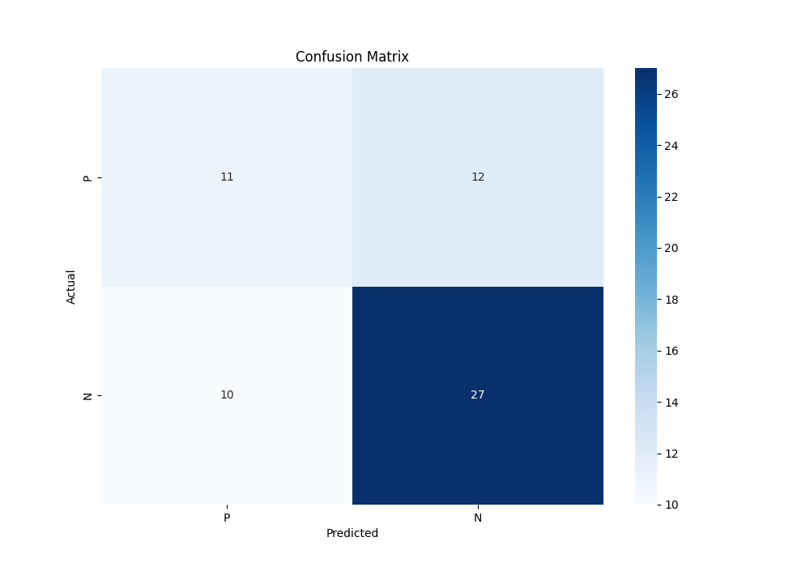
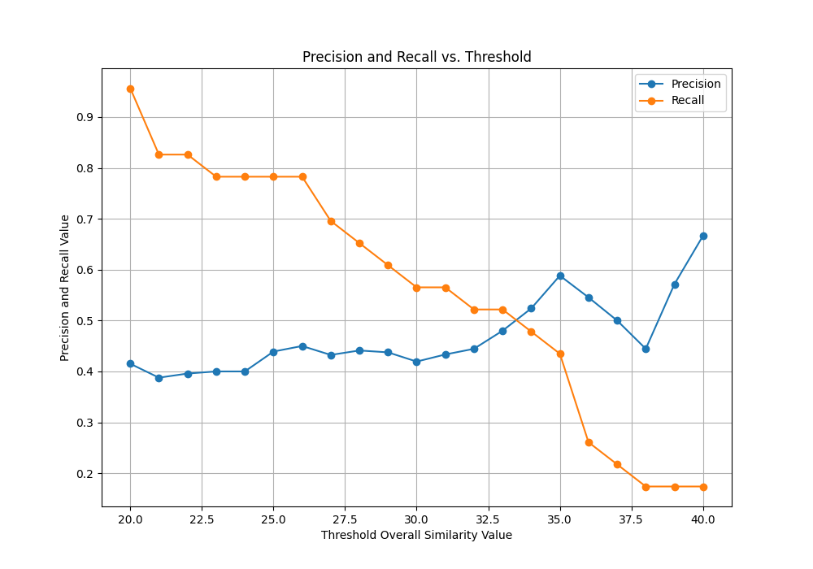

# Model Evaluation Report

## Confusion Matrix

## Precision and Recall vs. Threshold

## Metrics
- **Precision:** 0.52
- **Recall:** 0.48

## Actual Condition Counts and Ratios
- **Total Positives (P):** 23
- **Total Negatives (N):** 37
- **Positive Ratio:** 0.38
- **Negative Ratio:** 0.62

## Intersection Point
- **Threshold:** 33.48
- **Precision and Recall Value:** 0.50

