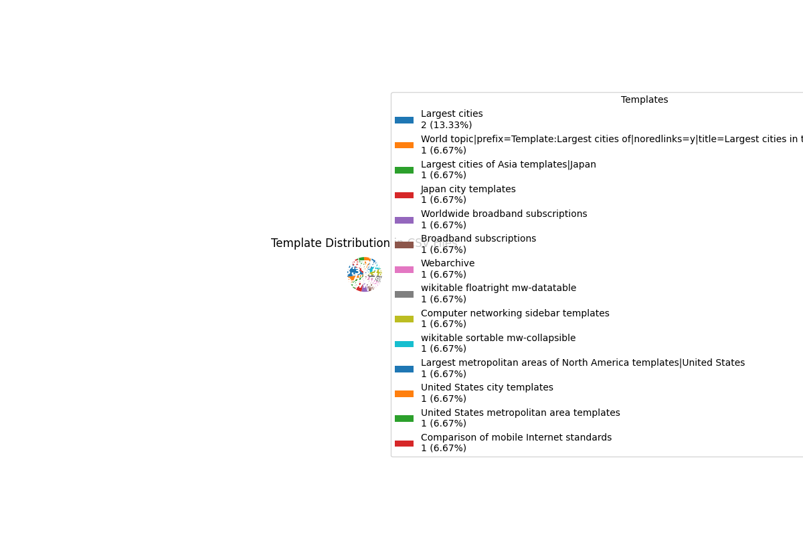

# Template Distribution Report
This report analyzes the distribution of templates across all CSV files in the current directory.

## Summary
Total number of templates: 15

## Template Distribution
- **Largest cities**: 2 (13.33%)
- **World topic|prefix=Template:Largest cities of|noredlinks=y|title=Largest cities in the world templates**: 1 (6.67%)
- **Largest cities of Asia templates|Japan**: 1 (6.67%)
- **Japan city templates**: 1 (6.67%)
- **Worldwide broadband subscriptions**: 1 (6.67%)
- **Broadband subscriptions**: 1 (6.67%)
- **Webarchive**: 1 (6.67%)
- **wikitable floatright mw-datatable**: 1 (6.67%)
- **Computer networking sidebar templates**: 1 (6.67%)
- **wikitable sortable mw-collapsible**: 1 (6.67%)
- **Largest metropolitan areas of North America templates|United States**: 1 (6.67%)
- **United States city templates**: 1 (6.67%)
- **United States metropolitan area templates**: 1 (6.67%)
- **Comparison of mobile Internet standards**: 1 (6.67%)

## Pie Chart

## Bar Chart

