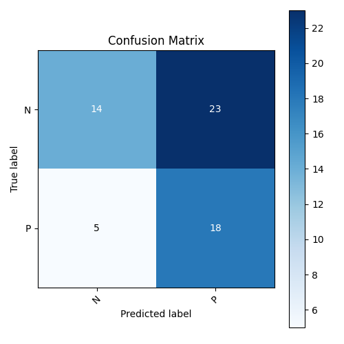

# Model Evaluation Report

## Confusion Matrix

## Metrics
- **Precision:** 0.44
- **Recall:** 0.78

## Actual Condition Counts and Ratios
- **Total Positives (P):** 23
- **Total Negatives (N):** 37
- **Positive Ratio:** 0.38
- **Negative Ratio:** 0.62
