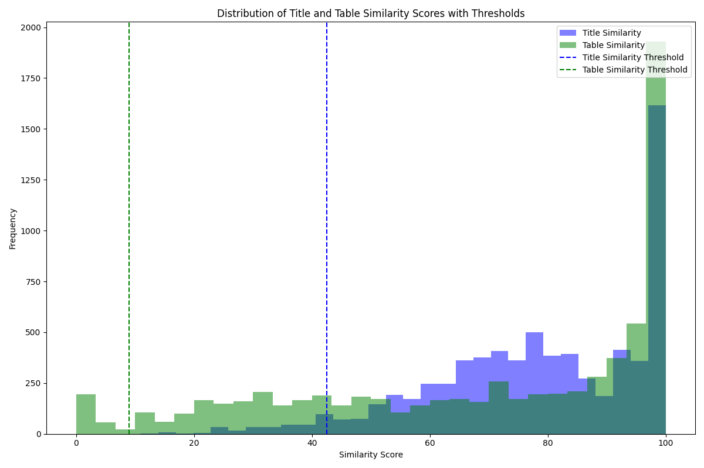

# Similarity Statistics

## Statistics

Average Title Similarity: 79.10

Average Table Similarity: 69.26

Average Overall Similarity: 75.71

Title Similarity Threshold (z=2.0): 43.11

Table Similarity Threshold (z=2.0): 8.15

Overall Similarity Threshold (z=2.0): 45.90

## 5 Rows with Lowest Title Similarity

| URL                                     | title                              | table_id                             | matched_title   |   title_similarity |   table_similarity |   overall_similarity |
|:----------------------------------------|:-----------------------------------|:-------------------------------------|:----------------|-------------------:|-------------------:|---------------------:|
| http://en.wikipedia.org/?curid=53880829 | Paula Mataele                      | da67bbfb-6c3b-4c9e-8bda-fb5dae644d04 | Răzvan Cojanu   |                 15 |                 20 |                   16 |
| http://en.wikipedia.org/?curid=53880829 | Paula Mataele                      | da67bbfb-6c3b-4c9e-8bda-fb5dae644d04 | Răzvan Cojanu   |                 15 |                 20 |                   16 |
| http://en.wikipedia.org/?curid=18934536 | Asymmetric Digital Subscriber Line | 625e09e2-c61d-43ca-8617-18f17a253f02 | ADSL            |                 16 |                 19 |                   16 |
| http://en.wikipedia.org/?curid=18934536 | Asymmetric Digital Subscriber Line | 625e09e2-c61d-43ca-8617-18f17a253f02 | ADSL            |                 16 |                 19 |                   16 |
| http://en.wikipedia.org/?curid=3848862  | Muhsin Corbbrey                    | 469e289e-fb18-4086-a1db-2094834b66bc | Nick Diaz       |                 17 |                 27 |                   20 |

## 5 Rows with Lowest Table Similarity

| URL                                     | title                                                          | table_id                             | matched_title                                         |   title_similarity |   table_similarity |   overall_similarity |
|:----------------------------------------|:---------------------------------------------------------------|:-------------------------------------|:------------------------------------------------------|-------------------:|-------------------:|---------------------:|
| http://en.wikipedia.org/?curid=639283   | List of rulers of Galicia and Volhynia - Rurik Dynasty         | 1f4f32d4-c26f-4ea1-98ad-89222c4c5b04 | Kingdom of Galicia–Volhynia                           |                 52 |                  0 |                   36 |
| http://en.wikipedia.org/?curid=60350760 | Sebastián Prieto                                               | 5adcbc95-1e12-446c-85c2-b64ef723f507 | Sebastián Prieto                                      |                100 |                  0 |                   70 |
| http://en.wikipedia.org/?curid=9226526  | Speedway Grand Prix of Denmark - Winners                       | 54101cd5-f4e6-438f-991f-65883eb44af6 | Speedway Grand Prix of Denmark                        |                 86 |                  0 |                   60 |
| http://en.wikipedia.org/?curid=683465   | List of former Jesuit secondary schools in the United States - | d0797210-9bf5-42a7-a36a-540b205adaa3 | List of Jesuit secondary schools in the United States |                 91 |                  0 |                   63 |
| http://en.wikipedia.org/?curid=31468646 | List of scandals in India - Notable scandals                   | 6de9f2be-f106-447e-88a3-dc3c523bcf4a | List of scandals in India                             |                 72 |                  0 |                   50 |

## 5 Rows with Highest Title Similarity

| URL                                     | title                                      | table_id                             | matched_title                              |   title_similarity |   table_similarity |   overall_similarity |
|:----------------------------------------|:-------------------------------------------|:-------------------------------------|:-------------------------------------------|-------------------:|-------------------:|---------------------:|
| http://en.wikipedia.org/?curid=10964790 | Tennis At The 1999 Pan American Games      | e9186e8f-997a-48a2-94e1-1b5b3f739b25 | Tennis at the 1999 Pan American Games      |                100 |                 73 |                   91 |
| http://en.wikipedia.org/?curid=20928682 | 1966 Miami Hurricanes Football Team        | 77950305-8949-4781-8818-a0d78a423fd6 | 1966 Miami Hurricanes football team        |                100 |                 32 |                   79 |
| http://en.wikipedia.org/?curid=17160236 | List Of Inter Milan Records And Statistics | bfa7cb13-8aa5-4aa3-abfc-4c91c035c30e | List of Inter Milan records and statistics |                100 |                 58 |                   87 |
| http://en.wikipedia.org/?curid=18304058 | Black Diamond Conference                   | 97efe342-6914-4580-9c70-aec29bfd4586 | Black Diamond Conference                   |                100 |                 43 |                   82 |
| http://en.wikipedia.org/?curid=1764207  | Loongson                                   | e111ac56-74cf-44cb-b181-e5fe35c5b60b | Loongson                                   |                100 |                 37 |                   81 |

## 5 Rows with Highest Table Similarity

| URL                                     | title                                                                                    | table_id                             | matched_title                                             |   title_similarity |   table_similarity |   overall_similarity |
|:----------------------------------------|:-----------------------------------------------------------------------------------------|:-------------------------------------|:----------------------------------------------------------|-------------------:|-------------------:|---------------------:|
| http://en.wikipedia.org/?curid=17572011 | 2008 National League Championship Series - Philadelphia Phillies vs. Los Angeles Dodgers | 6b23aaf9-1505-43ad-a443-f536eb4061f1 | 2008 National League Championship Series                  |                 62 |                100 |                   73 |
| http://en.wikipedia.org/?curid=32084404 | 2011 English Greyhound Derby - Final result                                              | b0955b83-1335-4520-abb0-769c874b664e | 2011 English Greyhound Derby                              |                 79 |                100 |                   85 |
| http://en.wikipedia.org/?curid=53376543 | 1978 Big Ten Conference football season - Results and team statistics                    | 83648ed0-878a-48e4-a36c-7c6ff51eed70 | 1978 Big Ten Conference football season                   |                 72 |                100 |                   80 |
| http://en.wikipedia.org/?curid=7268149  | List of Torchwood episodes - Series 2 (2008)                                             | 97fa161e-40f5-40fe-8bb5-a40a05348c09 | List of Torchwood episodes                                |                 74 |                100 |                   81 |
| http://en.wikipedia.org/?curid=7211436  | Canoeing at the 2004 Summer Olympics – Men's K-1 1000 metres - Heats                     | 6a6afea6-7e78-4c53-9a9e-3ab969a14772 | Canoeing at the 2004 Summer Olympics – Men's K-1 1000 ... |                 86 |                100 |                   90 |