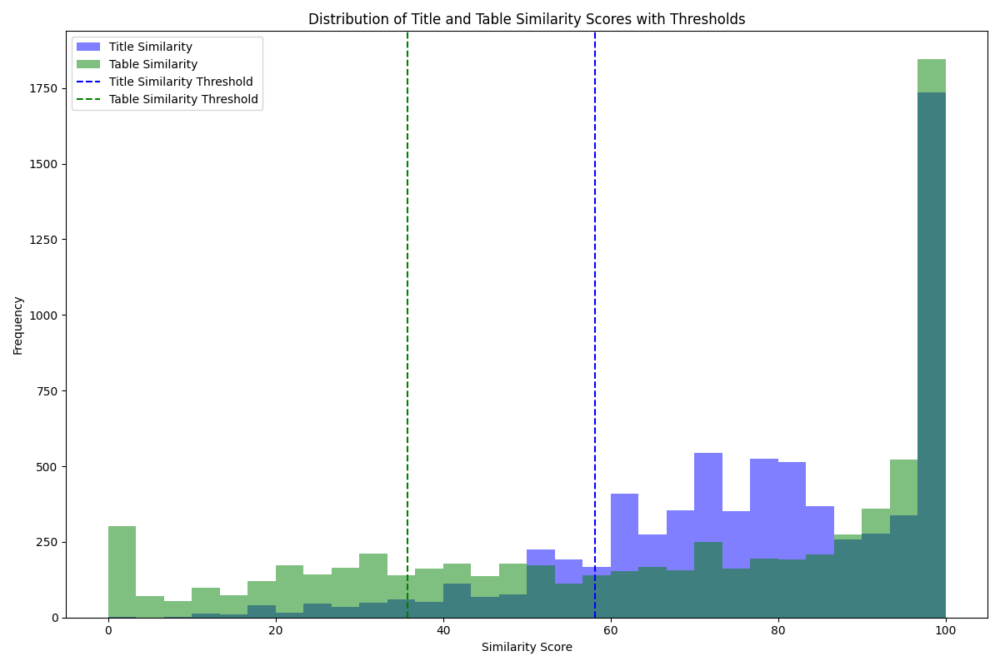

# Similarity Statistics

## Statistics

Average Title Similarity: 77.57

Average Table Similarity: 67.50

Average Overall Similarity: 74.10

Title Similarity Threshold (z=1.0): 58.19

Table Similarity Threshold (z=1.0): 35.80

Overall Similarity Threshold (z=1.0): 57.33

Tables below these thresholds should not be considered.

## 10 Rows with Lowest Title Similarity

| URL                                     | title                                                       | table_id                             | matched_title                               |   title_similarity |   table_similarity |   overall_similarity |
|:----------------------------------------|:------------------------------------------------------------|:-------------------------------------|:--------------------------------------------|-------------------:|-------------------:|---------------------:|
| Not found                               | 2008 - 09 Guildford Flames Season                           | 2946bef6-461f-4417-a3cf-1fe80eed147f | No title matched                            |                  0 |                  0 |                    0 |
| http://en.wikipedia.org/?curid=12430348 | List Of Largest Airlines In Central America & The Caribbean | 4fe58161-777f-41fc-a5a7-7a6db7bbde72 | Nog 9 rijen                                 |                  9 |                 13 |                   10 |
| http://en.wikipedia.org/?curid=12430348 | List Of Largest Airlines In Central America & The Caribbean | 4fe58161-777f-41fc-a5a7-7a6db7bbde72 | Nog 9 rijen                                 |                  9 |                 13 |                   10 |
| http://en.wikipedia.org/?curid=11805942 | List of K League 50-50 club members - Members               | 3b2e4a33-9642-4735-b22c-833d93a005cc | Kim Eun-jung (footballer)                   |                 11 |                 28 |                   16 |
| http://en.wikipedia.org/?curid=11805942 | List of K League 50-50 club members - Members               | 3b2e4a33-9642-4735-b22c-833d93a005cc | Kim Eun-jung (footballer)                   |                 11 |                 28 |                   16 |
| http://en.wikipedia.org/?curid=11805942 | List of K League 40-40 club members - Members               | a6bbb296-721d-431a-9c4d-5917a5a01988 | Kim Eun-jung (footballer)                   |                 11 |                 32 |                   17 |
| http://en.wikipedia.org/?curid=18758280 | Festivali i Këngës 47 - Results                             | 791e1189-6745-42a0-bc22-e41a92a14f81 | Albania in the Eurovision Song Contest 2009 |                 11 |                 71 |                   29 |
| http://en.wikipedia.org/?curid=18758280 | Festivali i Këngës 47 - Results                             | 791e1189-6745-42a0-bc22-e41a92a14f81 | Albania in the Eurovision Song Contest 2009 |                 11 |                 71 |                   29 |
| http://en.wikipedia.org/?curid=9556008  | Erika Jayne - Accolades                                     | 04d4fe14-b910-4c1b-9342-a60a0d9487ae | Thomas Girardi                              |                 11 |                  0 |                    7 |
| http://en.wikipedia.org/?curid=11805942 | List of K League 40-40 club members - Members               | a6bbb296-721d-431a-9c4d-5917a5a01988 | Kim Eun-jung (footballer)                   |                 11 |                 32 |                   17 |

## 10 Rows with Lowest Table Similarity

| URL                                     | title                                                          | table_id                             | matched_title                                         |   title_similarity |   table_similarity |   overall_similarity |
|:----------------------------------------|:---------------------------------------------------------------|:-------------------------------------|:------------------------------------------------------|-------------------:|-------------------:|---------------------:|
| http://en.wikipedia.org/?curid=639283   | List of rulers of Galicia and Volhynia - Rurik Dynasty         | 1f4f32d4-c26f-4ea1-98ad-89222c4c5b04 | Kingdom of Galicia–Volhynia                           |                 52 |                  0 |                   36 |
| http://en.wikipedia.org/?curid=9226526  | Speedway Grand Prix of Denmark - Winners                       | 54101cd5-f4e6-438f-991f-65883eb44af6 | Speedway Grand Prix of Denmark                        |                 86 |                  0 |                   60 |
| http://en.wikipedia.org/?curid=683465   | List of former Jesuit secondary schools in the United States - | d0797210-9bf5-42a7-a36a-540b205adaa3 | List of Jesuit secondary schools in the United States |                 91 |                  0 |                   63 |
| http://en.wikipedia.org/?curid=31468646 | List of scandals in India - Notable scandals                   | 6de9f2be-f106-447e-88a3-dc3c523bcf4a | List of scandals in India                             |                 72 |                  0 |                   50 |
| http://en.wikipedia.org/?curid=174491   | Nordic Skiing                                                  | 74bebba1-2a15-4866-b452-61d6e4453736 | Nordic skiing                                         |                100 |                  0 |                   70 |
| http://en.wikipedia.org/?curid=683465   | List of former Jesuit secondary schools in the United States - | d792e668-f05a-438d-bb9f-f1300031a91d | List of Jesuit secondary schools in the United States |                 91 |                  0 |                   63 |
| http://en.wikipedia.org/?curid=3843739  | Sports in Florida - Stadiums and arenas                        | d844ee5b-3e85-47a9-b7cc-0cfd464c1e7f | Category:Sports venues in Florida                     |                 47 |                  0 |                   32 |
| http://en.wikipedia.org/?curid=11570929 | Maritime Company Of Lesvos                                     | 1e6af0ed-1b3c-493f-9b59-65142bfe6053 | Maritime Company of Lesvos                            |                100 |                  0 |                   70 |
| http://en.wikipedia.org/?curid=16951760 | Ryan Harris (cricketer) - Test 5 wicket hauls                  | d4e286f3-6861-4d84-bdab-86dc65504b36 | Ryan Harris (cricketer)                               |                 68 |                  0 |                   47 |
| http://en.wikipedia.org/?curid=63862683 | Operation Gideon                                               | 4eb09181-2967-4a16-9df8-f0b7e0a4d2b0 | Operation Gideon (2020)                               |                 82 |                  0 |                   57 |