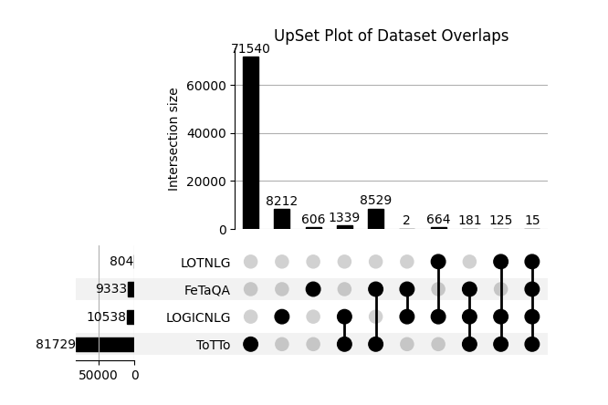

# Detailed Statistical Report of Overlapped URLs

## Overlaps Between Datasets

### FeTaQA and LOGICNLG
Total overlapping URLs: 198

### FeTaQA and LOTNLG
Total overlapping URLs: 15

### FeTaQA and ToTTo
Total overlapping URLs: 8725

### LOGICNLG and LOTNLG
Total overlapping URLs: 804

### LOGICNLG and ToTTo
Total overlapping URLs: 1660

### LOTNLG and ToTTo
Total overlapping URLs: 140

## UpSet Plot of Dataset Overlaps

