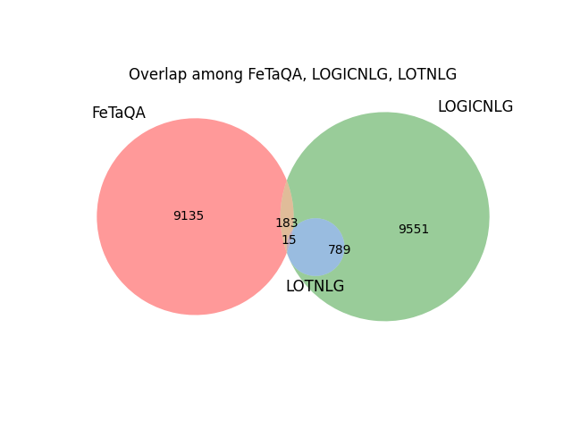
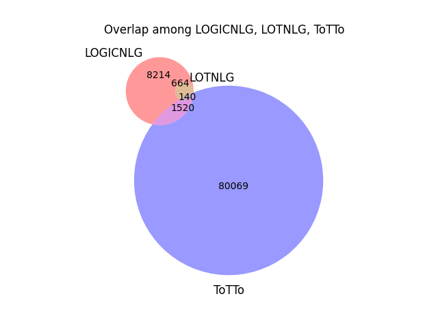

# Detailed Statistical Report of Overlapped URLs

## Overlaps Between Datasets

### Overlap among FeTaQA, LOGICNLG, LOTNLG

Total overlapping URLs: 15

### Overlap among FeTaQA, LOGICNLG, ToTTo

Total overlapping URLs: 196

### Overlap among FeTaQA, LOTNLG, ToTTo

Total overlapping URLs: 15

### Overlap among LOGICNLG, LOTNLG, ToTTo

Total overlapping URLs: 140

## Comprehensive Summary

Total unique URLs across all datasets: 91213

Largest dataset: ToTTo with 81729 URLs.
Smallest dataset: LOTNLG with 804 URLs.
URLs appearing in exactly 1 datasets: 80358
URLs appearing in exactly 2 datasets: 10534
URLs appearing in exactly 3 datasets: 306
URLs appearing in exactly 4 datasets: 15
