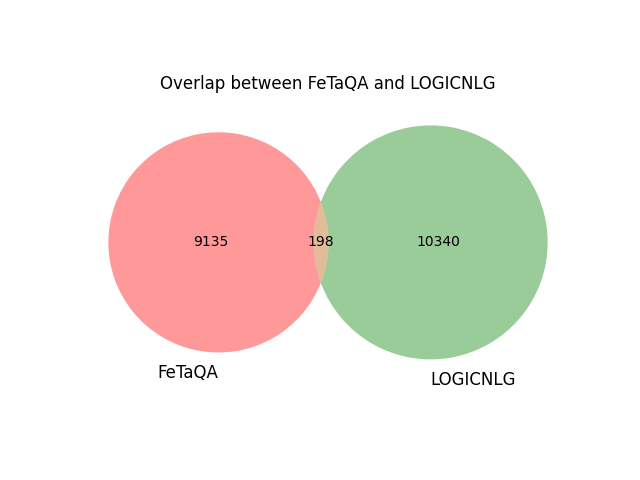
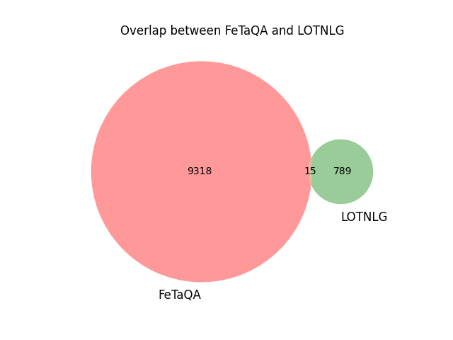
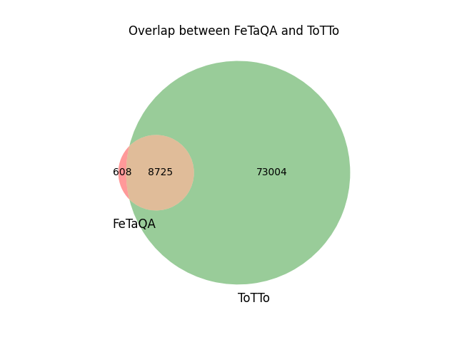
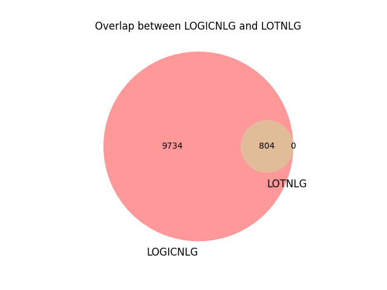
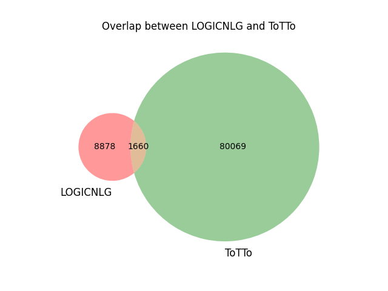
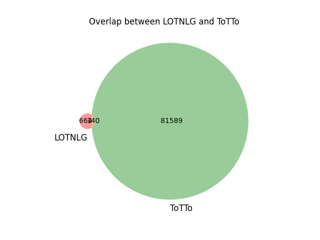
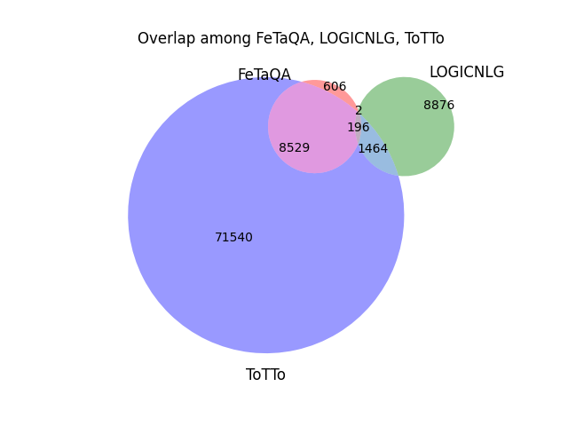
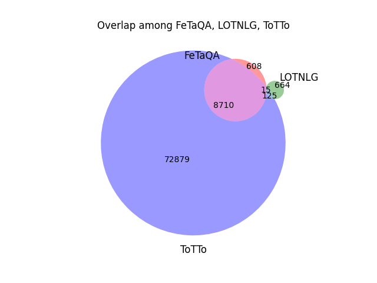
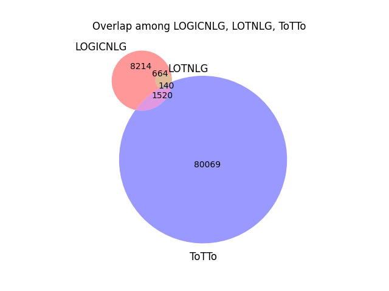

# Detailed Statistical Report of Overlapped URLs

## Individual Dataset Information

- **FeTaQA**: 9333 unique URLs
- **LOGICNLG**: 10538 unique URLs
- **LOTNLG**: 804 unique URLs
- **ToTTo**: 81729 unique URLs

## Overlaps Between Datasets

### FeTaQA and LOGICNLG

Total overlapping URLs: 198

### FeTaQA and LOTNLG

Total overlapping URLs: 15

### FeTaQA and ToTTo

Total overlapping URLs: 8725

### LOGICNLG and LOTNLG

Total overlapping URLs: 804

### LOGICNLG and ToTTo

Total overlapping URLs: 1660

### LOTNLG and ToTTo

Total overlapping URLs: 140

### Overlap among FeTaQA, LOGICNLG, LOTNLG

Total overlapping URLs: 15

### Overlap among FeTaQA, LOGICNLG, ToTTo

Total overlapping URLs: 196

### Overlap among FeTaQA, LOTNLG, ToTTo

Total overlapping URLs: 15

### Overlap among LOGICNLG, LOTNLG, ToTTo

Total overlapping URLs: 140

## Summary for Four-Way Overlap
All four datasets have 15 common URLs.
