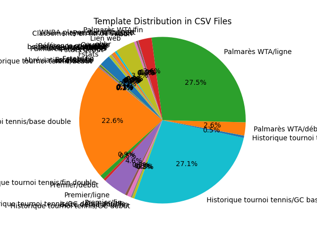
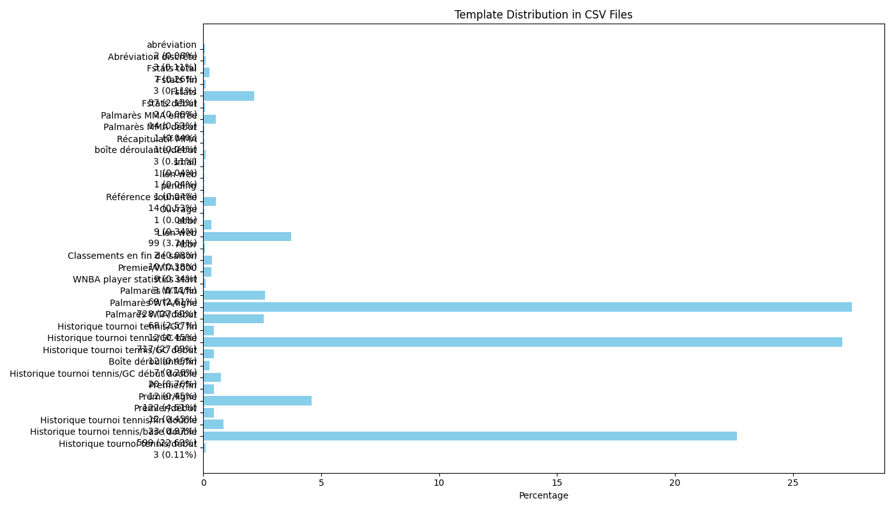

# Template Distribution Report
This report analyzes the distribution of templates across all CSV files in the current directory.

## Summary
Total number of templates: 2647

## Template Distribution
- **Historique tournoi tennis/début**: 0.11%
- **Historique tournoi tennis/base double**: 22.63%
- **Historique tournoi tennis/fin double**: 0.87%
- **Premier/début**: 0.45%
- **Premier/ligne**: 4.61%
- **Premier/fin**: 0.45%
- **Historique tournoi tennis/GC début double**: 0.76%
- **Boîte déroulante/fin**: 0.26%
- **Historique tournoi tennis/GC début**: 0.45%
- **Historique tournoi tennis/GC base**: 27.09%
- **Historique tournoi tennis/GC fin**: 0.45%
- **Palmarès WTA/début**: 2.57%
- **Palmarès WTA/ligne**: 27.50%
- **Palmarès WTA/fin**: 2.61%
- **WNBA player statistics start**: 0.11%
- **Premier/WTA1000**: 0.34%
- **Classements en fin de saison**: 0.38%
- **Abbr**: 0.08%
- **Lien web**: 3.74%
- **abbr**: 0.34%
- **Ouvrage**: 0.04%
- **Référence souhaitée**: 0.53%
- **pending**: 0.04%
- **lien web**: 0.04%
- **small**: 0.04%
- **boîte déroulante/début**: 0.11%
- **Récapitulatif MMA**: 0.04%
- **Palmarès MMA début**: 0.04%
- **Palmarès MMA entrée**: 0.53%
- **Fstats début**: 0.08%
- **Fstats**: 2.15%
- **Fstats fin**: 0.11%
- **Fstats total**: 0.26%
- **Abréviation discrète**: 0.11%
- **abréviation**: 0.08%

## Pie Chart

## Bar Chart

