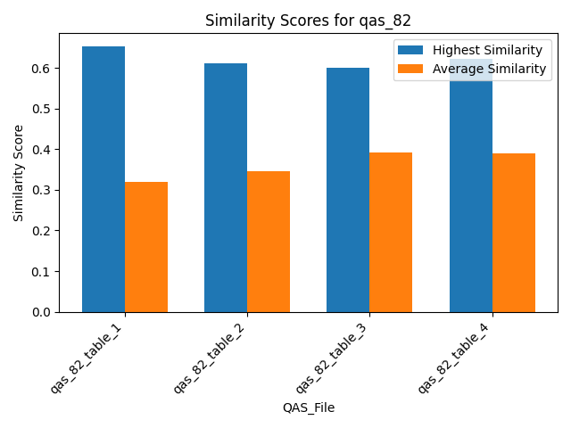
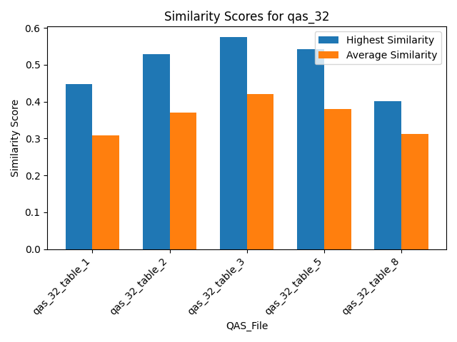
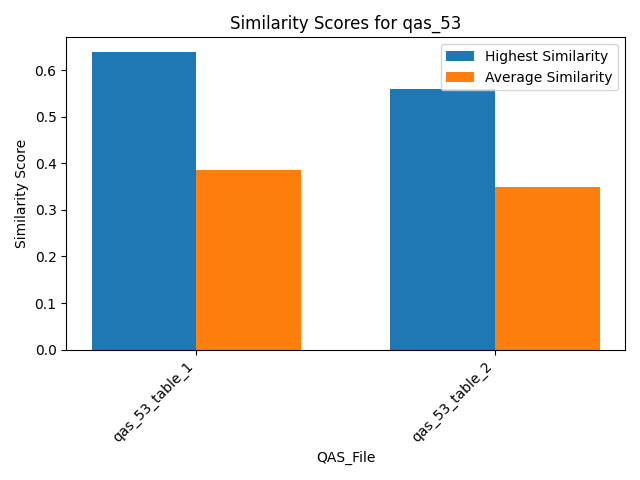
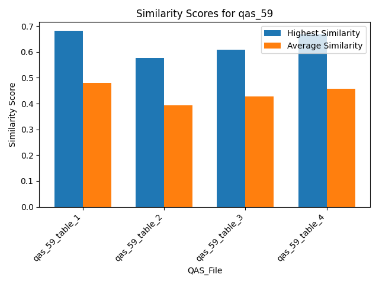
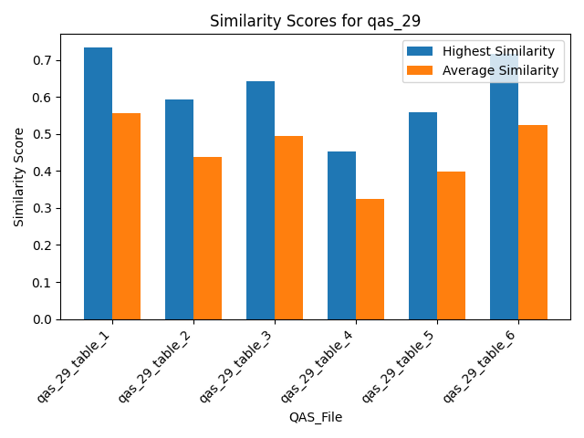
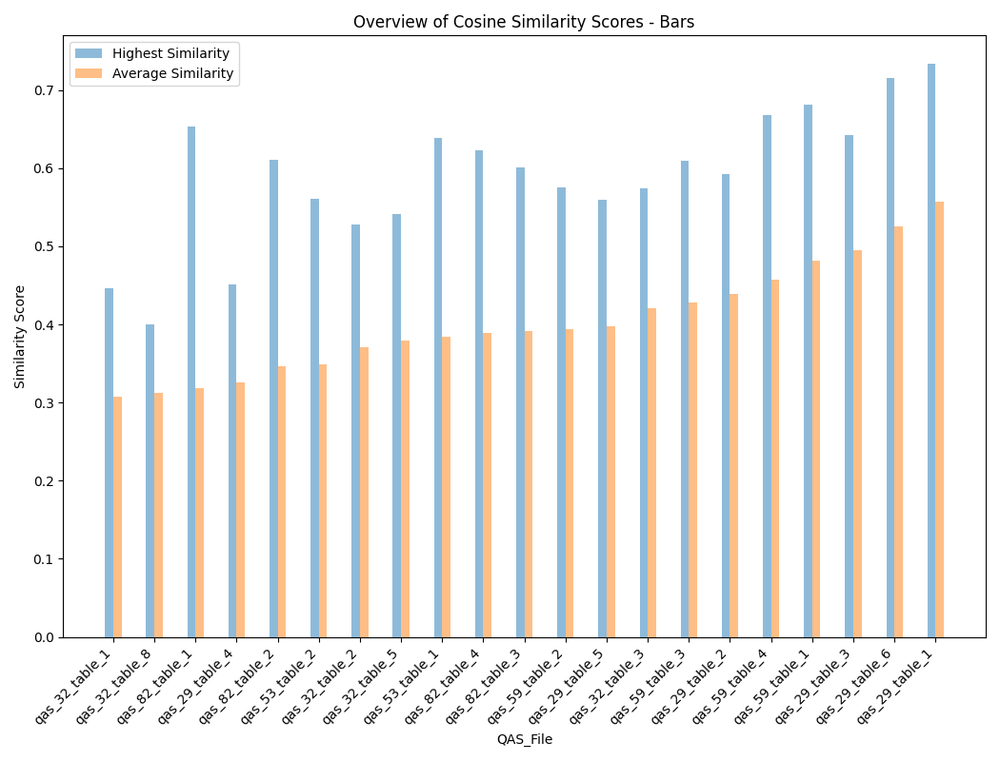
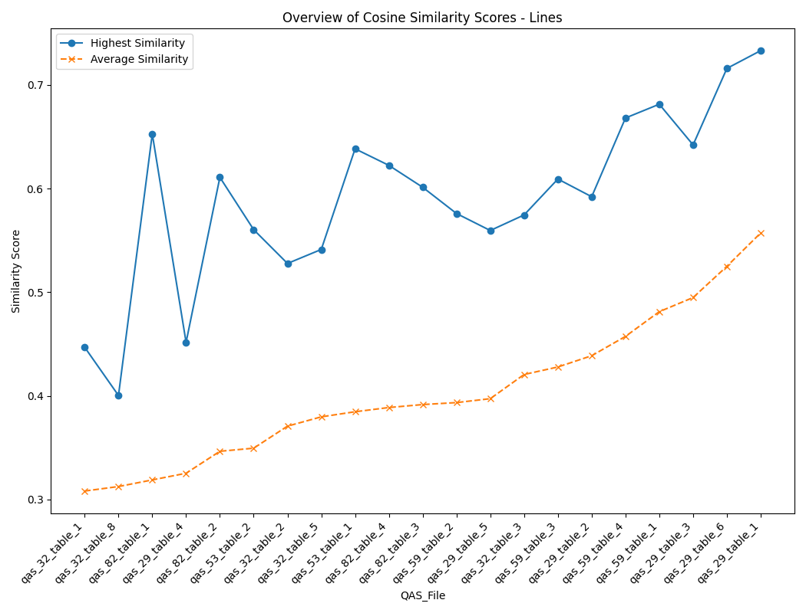
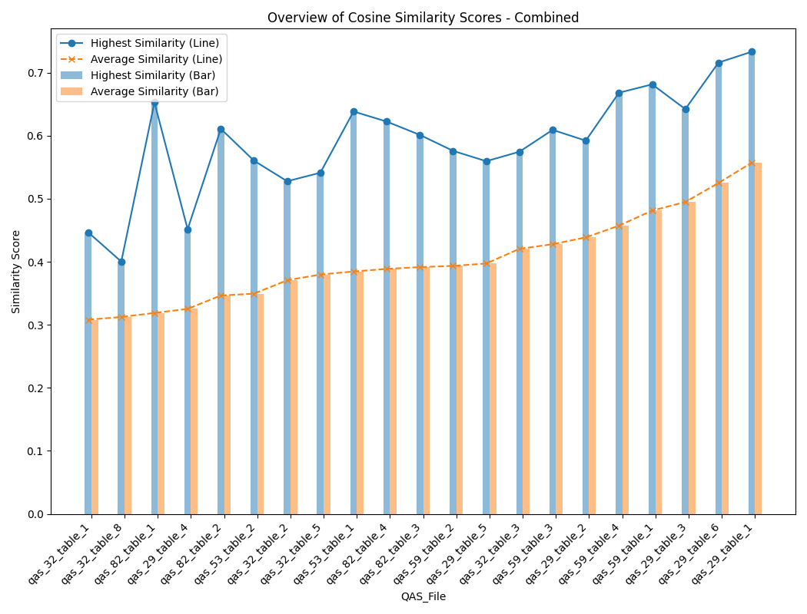

## Similarity Scores for qas_82

## Similarity Scores for qas_32

## Similarity Scores for qas_53

## Similarity Scores for qas_59

## Similarity Scores for qas_29

## Summary Table
| QAS_File       |   Average Cosine |   Highest Cosine |   Median Cosine |
|:---------------|-----------------:|-----------------:|----------------:|
| All            |         0.403312 |         0.733224 |        0.391568 |
| qas_82_table_1 |         0.318833 |         0.652801 |        0.318833 |
| qas_82_table_2 |         0.346473 |         0.610928 |        0.346473 |
| qas_82_table_3 |         0.391568 |         0.601325 |        0.391568 |
| qas_82_table_4 |         0.388717 |         0.622476 |        0.388717 |
| qas_32_table_1 |         0.308094 |         0.446892 |        0.308094 |
| qas_32_table_2 |         0.370727 |         0.527778 |        0.370727 |
| qas_32_table_3 |         0.420595 |         0.574597 |        0.420595 |
| qas_32_table_5 |         0.379719 |         0.541298 |        0.379719 |
| qas_32_table_8 |         0.312443 |         0.400327 |        0.312443 |
| qas_53_table_1 |         0.384636 |         0.638456 |        0.384636 |
| qas_53_table_2 |         0.349457 |         0.560397 |        0.349457 |
| qas_59_table_1 |         0.481231 |         0.681501 |        0.481231 |
| qas_59_table_2 |         0.393478 |         0.576    |        0.393478 |
| qas_59_table_3 |         0.427852 |         0.609269 |        0.427852 |
| qas_59_table_4 |         0.457364 |         0.668199 |        0.457364 |
| qas_29_table_1 |         0.557221 |         0.733224 |        0.557221 |
| qas_29_table_2 |         0.438711 |         0.592198 |        0.438711 |
| qas_29_table_3 |         0.494871 |         0.642217 |        0.494871 |
| qas_29_table_4 |         0.325275 |         0.451622 |        0.325275 |
| qas_29_table_5 |         0.397249 |         0.55959  |        0.397249 |
| qas_29_table_6 |         0.525033 |         0.716052 |        0.525033 |

## Overview of Similarity Scores - Bars

## Overview of Similarity Scores - Lines

## Overview of Similarity Scores - Combined

## Additional Table
| instance_name   |   nr of tables |   nr of paragraphs |   nr of comparisons | URL                                     |
|:----------------|---------------:|-------------------:|--------------------:|:----------------------------------------|
| instance_29     |              6 |                 43 |                 258 | https://fr.wikipedia.org/?curid=1424248 |
| instance_59     |              4 |                 32 |                 128 | https://fr.wikipedia.org/?curid=5892703 |
| instance_32     |              5 |                 30 |                 150 | https://fr.wikipedia.org/?curid=1255401 |
| instance_53     |              2 |                 44 |                  88 | https://fr.wikipedia.org/?curid=342938  |
| instance_82     |              4 |                 34 |                 136 | https://fr.wikipedia.org/?curid=150171  |

