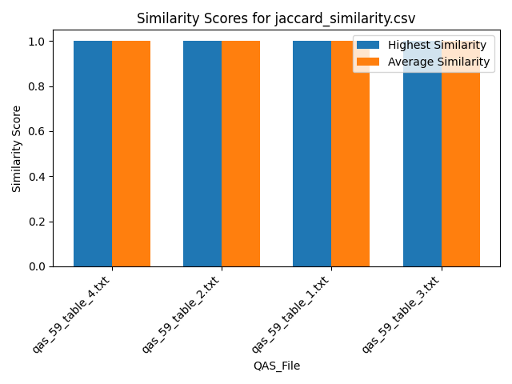
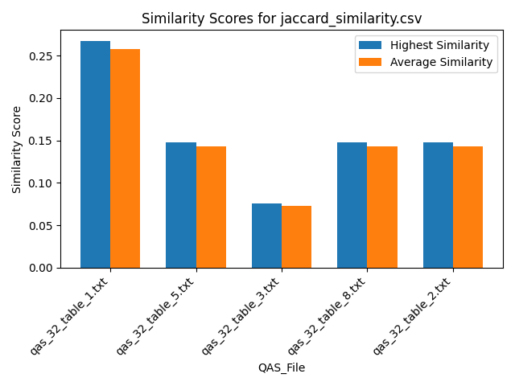
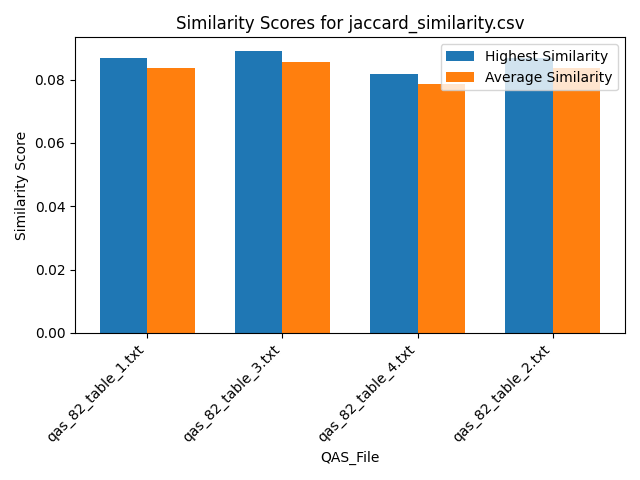
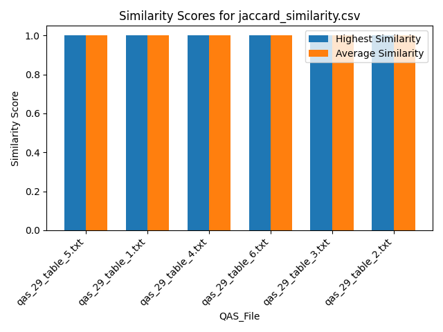
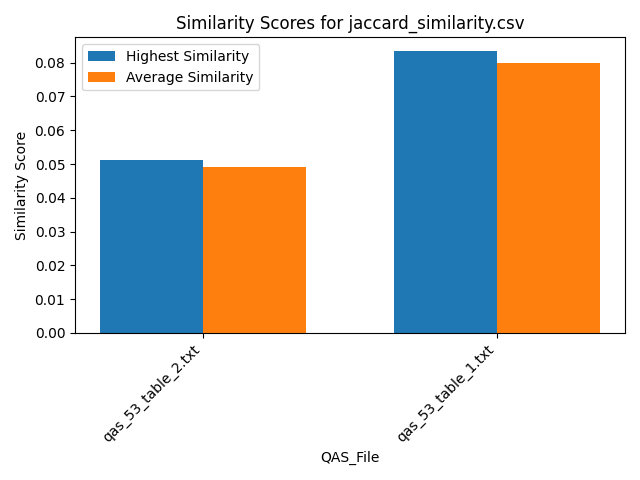

## Similarity Scores for cosine_similarity.csv

## Similarity Scores for cosine_similarity.csv

## Similarity Scores for cosine_similarity.csv

## Similarity Scores for cosine_similarity.csv

## Similarity Scores for cosine_similarity.csv

## Similarity Scores for jaccard_similarity.csv

## Similarity Scores for jaccard_similarity.csv

## Similarity Scores for jaccard_similarity.csv

## Similarity Scores for jaccard_similarity.csv

## Similarity Scores for jaccard_similarity.csv

## Summary Table
| QAS_File         ** | ** Average Cosine | ** Highest Cosine | ** Average Jaccard | ** Highest Jaccard |
|:-------------------|-----------------:|-----------------:|------------------:|------------------:|
| All              ** | **      0.121879** | **      0.401636** | **       0.222246** | **       1       ** |
| qas_59_table_2.txt | **      0.30961 ** | **      0.38728 ** | **       0.78125 ** | **       1       ** |
| qas_59_table_4.txt | **      0.104876** | **      0.137942** | **       0.143519** | **       0.148148** |
| qas_59_table_1.txt | **      0.0731822 | **      0.0946761 | **       0.0824468 | **       0.0851064 |
| qas_59_table_3.txt | **      0.321803** | **      0.401636** | **       0.78125 ** | **       1       ** |
| qas_32_table_5.txt | **      0.100462** | **      0.12794 ** | **       0.14321 ** | **       0.148148** |
| qas_32_table_8.txt | **      0.076336** | **      0.0880101 | **       0.14321 ** | **       0.148148** |
| qas_32_table_2.txt | **      0.0962755 | **      0.112844** | **       0.14321 ** | **       0.148148** |
| qas_32_table_1.txt | **      0.108626** | **      0.136738** | **       0.257778** | **       0.266667** |
| qas_32_table_3.txt | **      0.0753163 | **      0.0821801 | **       0.072956** | **       0.0754717 |
| qas_82_table_1.txt | **      0.0658691 | **      0.0836134 | **       0.0837596 | **       0.0869565 |
| qas_82_table_3.txt | **      0.061202** | **      0.0824857 | **       0.0856209 | **       0.0888889 |
| qas_82_table_4.txt | **      0.0826418 | **      0.101056** | **       0.0786315 | **       0.0816327 |
| qas_82_table_2.txt | **      0.0837472 | **      0.100626** | **       0.0837596 | **       0.0869565 |
| qas_29_table_5.txt | **      0.227896** | **      0.292031** | **       0.524917** | **       0.571429** |
| qas_29_table_2.txt | **      0.0870051 | **      0.112978** | **       0.0918605 | **       0.1     ** |
| qas_29_table_4.txt | **      0.322284** | **      0.386749** | **       0.831395** | **       1       ** |
| qas_29_table_1.txt | **      0.0771045 | **      0.105799** | **       0.0592648 | **       0.0645161 |
| qas_29_table_3.txt | **      0.0874774 | **      0.112501** | **       0.08962 ** | **       0.097561** |
| qas_29_table_6.txt | **      0.0725895 | **      0.0907589 | **       0.0602364 | **       0.0655738 |
| qas_53_table_2.txt | **      0.0465267 | **      0.061065** | **       0.0492424 | **       0.0512821 |
| qas_53_table_1.txt | **      0.0786238 | **      0.104761** | **       0.0800189 | **       0.0833333 |

## Overview of Similarity Scores - Bars

## Overview of Similarity Scores - Lines

## Overview of Similarity Scores - Combined

