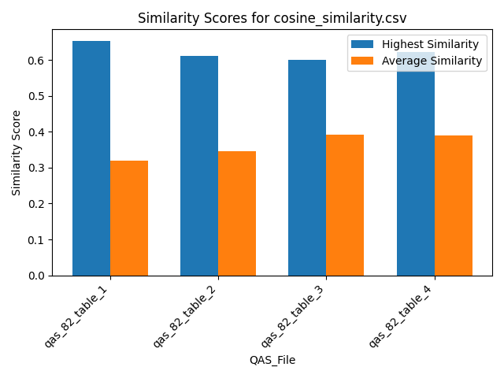
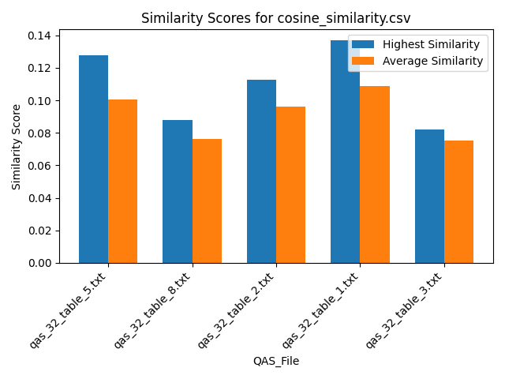
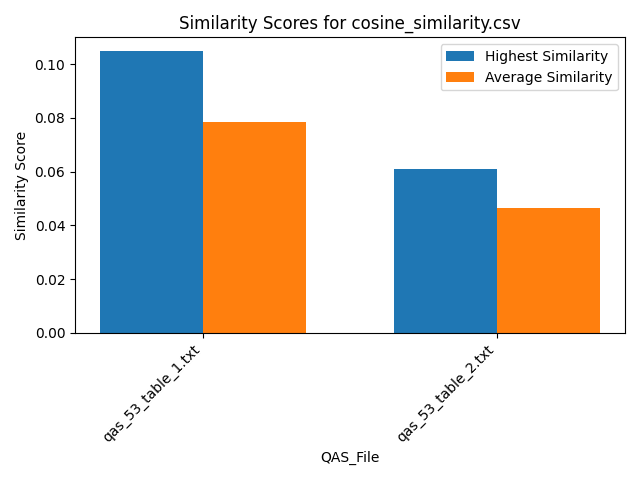
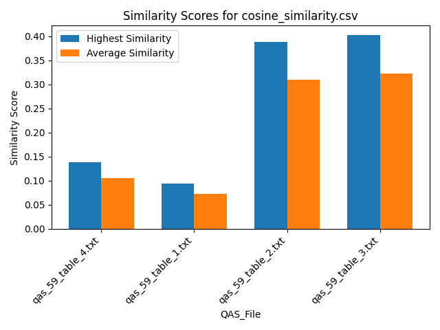
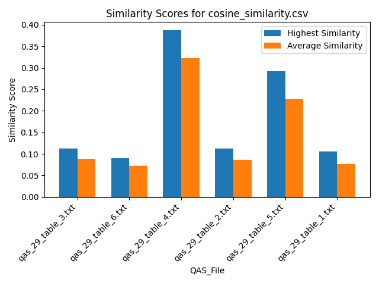
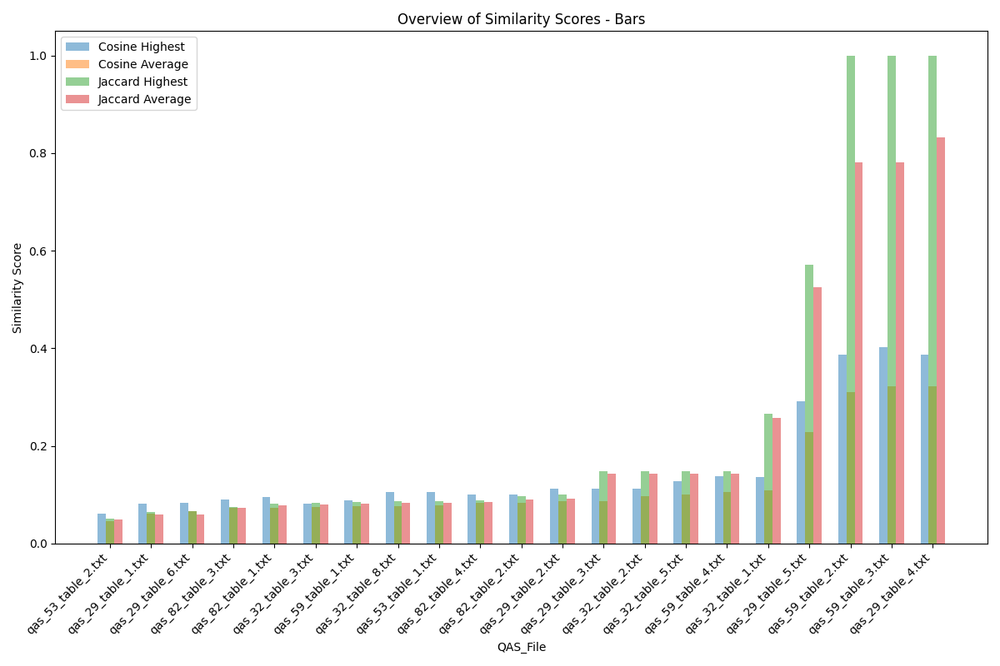
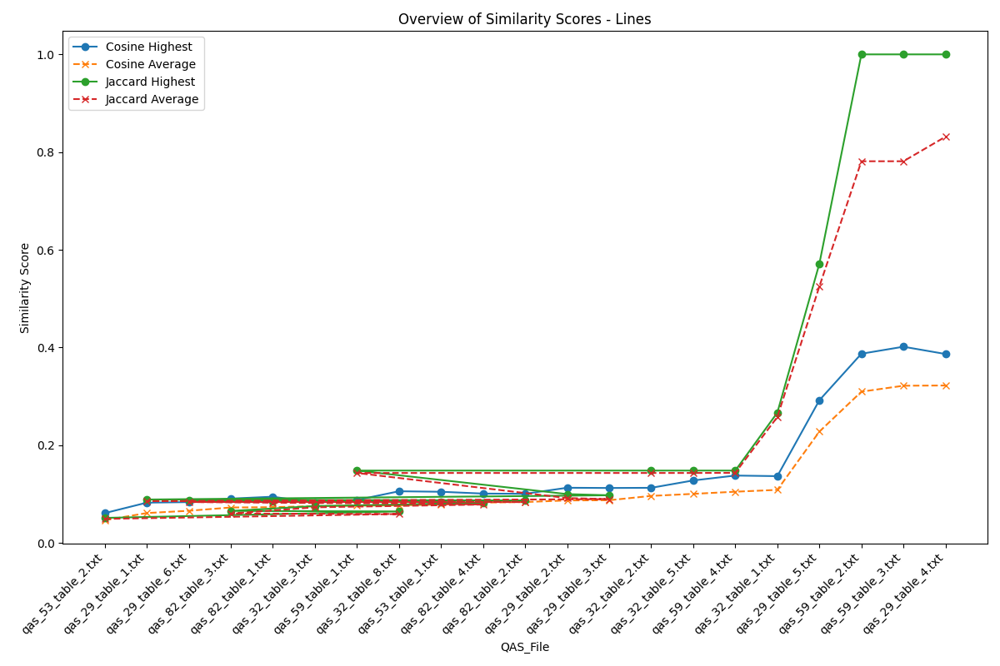
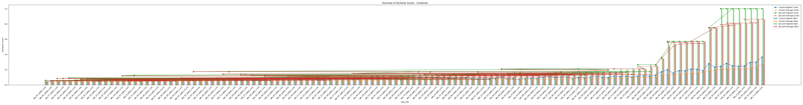

## Similarity Scores for cosine_similarity.csv

## Similarity Scores for cosine_similarity.csv

## Similarity Scores for cosine_similarity.csv

## Similarity Scores for cosine_similarity.csv

## Similarity Scores for cosine_similarity.csv

## Summary Table
| QAS_File           |   Average Cosine |   Highest Cosine |   Median Cosine |
|:-------------------|-----------------:|-----------------:|----------------:|
| All                |         0.236665 |         0.460681 |        0.23607  |
| qas_82_table_2.txt |         0.229798 |         0.409935 |        0.229798 |
| qas_82_table_4.txt |         0.238822 |         0.356839 |        0.238822 |
| qas_82_table_1.txt |         0.223909 |         0.347145 |        0.223909 |
| qas_82_table_3.txt |         0.23607  |         0.34151  |        0.23607  |
| qas_32_table_8.txt |         0.191138 |         0.261747 |        0.191138 |
| qas_32_table_1.txt |         0.143502 |         0.235268 |        0.143502 |
| qas_32_table_5.txt |         0.1869   |         0.262654 |        0.1869   |
| qas_32_table_2.txt |         0.164598 |         0.223669 |        0.164598 |
| qas_32_table_3.txt |         0.186691 |         0.292929 |        0.186691 |
| qas_53_table_2.txt |         0.224785 |         0.384071 |        0.224785 |
| qas_53_table_1.txt |         0.284653 |         0.460681 |        0.284653 |
| qas_59_table_4.txt |         0.278248 |         0.420879 |        0.278248 |
| qas_59_table_2.txt |         0.307345 |         0.415103 |        0.307345 |
| qas_59_table_1.txt |         0.266418 |         0.388627 |        0.266418 |
| qas_59_table_3.txt |         0.311378 |         0.446495 |        0.311378 |
| qas_29_table_5.txt |         0.164655 |         0.248617 |        0.164655 |
| qas_29_table_1.txt |         0.274197 |         0.377177 |        0.274197 |
| qas_29_table_4.txt |         0.206504 |         0.340752 |        0.206504 |
| qas_29_table_6.txt |         0.279452 |         0.374969 |        0.279452 |
| qas_29_table_3.txt |         0.287989 |         0.373234 |        0.287989 |
| qas_29_table_2.txt |         0.282903 |         0.375547 |        0.282903 |

## Overview of Similarity Scores - Bars

## Overview of Similarity Scores - Lines

## Overview of Similarity Scores - Combined

## Additional Table
| instance_name   |   nr of tables |   nr of paragraphs |   nr of comparisons | URL                                     |
|:----------------|---------------:|-------------------:|--------------------:|:----------------------------------------|
| instance_29     |              6 |                  0 |                   0 | https://fr.wikipedia.org/?curid=1424248 |
| instance_59     |              4 |                  0 |                   0 | https://fr.wikipedia.org/?curid=5892703 |
| instance_32     |              5 |                  0 |                   0 | https://fr.wikipedia.org/?curid=1255401 |
| instance_53     |              2 |                  0 |                   0 | https://fr.wikipedia.org/?curid=342938  |
| instance_82     |              4 |                  0 |                   0 | https://fr.wikipedia.org/?curid=150171  |

