## Similarity Scores for cosine_similarity.csv

## Similarity Scores for cosine_similarity.csv

## Similarity Scores for cosine_similarity.csv

## Similarity Scores for cosine_similarity.csv
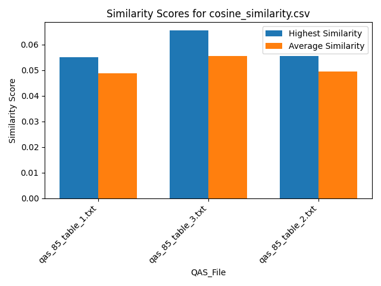

## Similarity Scores for cosine_similarity.csv

## Similarity Scores for cosine_similarity.csv

## Similarity Scores for cosine_similarity.csv

## Similarity Scores for cosine_similarity.csv

## Similarity Scores for cosine_similarity.csv

## Similarity Scores for cosine_similarity.csv

## Similarity Scores for cosine_similarity.csv

## Similarity Scores for cosine_similarity.csv

## Similarity Scores for cosine_similarity.csv
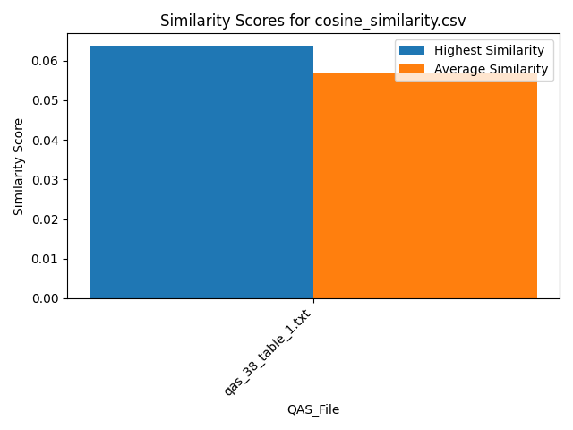

## Similarity Scores for cosine_similarity.csv

## Similarity Scores for cosine_similarity.csv

## Similarity Scores for cosine_similarity.csv

## Similarity Scores for cosine_similarity.csv

## Similarity Scores for cosine_similarity.csv

## Similarity Scores for cosine_similarity.csv

## Similarity Scores for cosine_similarity.csv

## Similarity Scores for cosine_similarity.csv

## Similarity Scores for cosine_similarity.csv

## Similarity Scores for cosine_similarity.csv
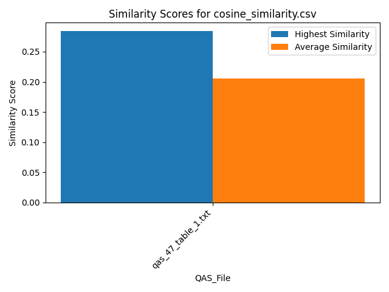

## Similarity Scores for cosine_similarity.csv

## Similarity Scores for cosine_similarity.csv

## Similarity Scores for cosine_similarity.csv
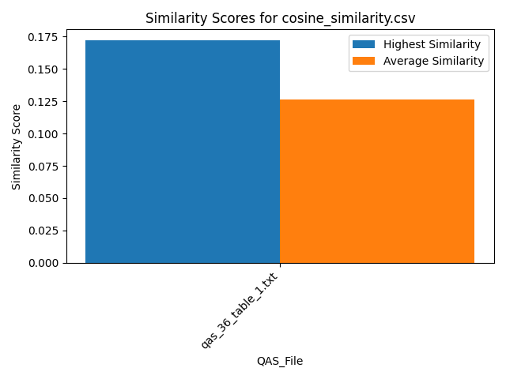

## Similarity Scores for cosine_similarity.csv

## Similarity Scores for cosine_similarity.csv

## Similarity Scores for cosine_similarity.csv
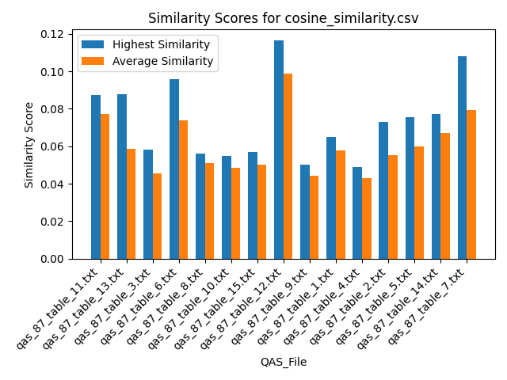

## Similarity Scores for cosine_similarity.csv

## Similarity Scores for cosine_similarity.csv

## Similarity Scores for cosine_similarity.csv

## Similarity Scores for cosine_similarity.csv

## Similarity Scores for cosine_similarity.csv

## Similarity Scores for cosine_similarity.csv

## Similarity Scores for cosine_similarity.csv

## Similarity Scores for cosine_similarity.csv

## Similarity Scores for cosine_similarity.csv
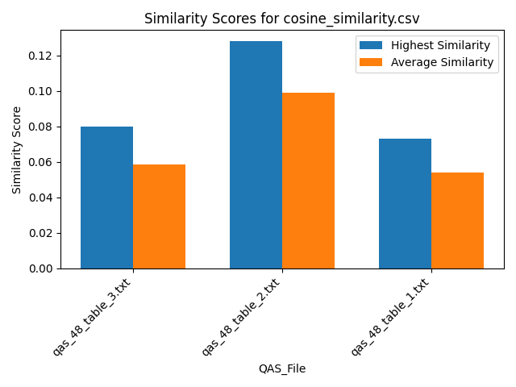

## Similarity Scores for cosine_similarity.csv

## Similarity Scores for cosine_similarity.csv

## Similarity Scores for cosine_similarity.csv

## Similarity Scores for cosine_similarity.csv

## Similarity Scores for cosine_similarity.csv

## Similarity Scores for cosine_similarity.csv

## Similarity Scores for cosine_similarity.csv

## Similarity Scores for cosine_similarity.csv

## Similarity Scores for cosine_similarity.csv

## Similarity Scores for cosine_similarity.csv

## Similarity Scores for cosine_similarity.csv

## Similarity Scores for cosine_similarity.csv

## Similarity Scores for cosine_similarity.csv
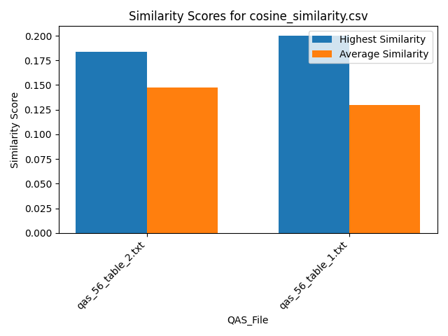

## Similarity Scores for cosine_similarity.csv

## Similarity Scores for cosine_similarity.csv

## Similarity Scores for cosine_similarity.csv

## Similarity Scores for cosine_similarity.csv

## Similarity Scores for cosine_similarity.csv

## Similarity Scores for cosine_similarity.csv

## Similarity Scores for cosine_similarity.csv

## Similarity Scores for cosine_similarity.csv

## Similarity Scores for cosine_similarity.csv

## Similarity Scores for cosine_similarity.csv

## Similarity Scores for cosine_similarity.csv

## Similarity Scores for cosine_similarity.csv

## Similarity Scores for cosine_similarity.csv

## Similarity Scores for cosine_similarity.csv

## Similarity Scores for cosine_similarity.csv

## Similarity Scores for cosine_similarity.csv

## Similarity Scores for cosine_similarity.csv

## Similarity Scores for cosine_similarity.csv

## Similarity Scores for cosine_similarity.csv

## Similarity Scores for cosine_similarity.csv

## Similarity Scores for jaccard_similarity.csv

## Similarity Scores for jaccard_similarity.csv

## Similarity Scores for jaccard_similarity.csv

## Similarity Scores for jaccard_similarity.csv

## Similarity Scores for jaccard_similarity.csv

## Similarity Scores for jaccard_similarity.csv

## Similarity Scores for jaccard_similarity.csv

## Similarity Scores for jaccard_similarity.csv

## Similarity Scores for jaccard_similarity.csv

## Similarity Scores for jaccard_similarity.csv

## Similarity Scores for jaccard_similarity.csv

## Similarity Scores for jaccard_similarity.csv

## Similarity Scores for jaccard_similarity.csv

## Similarity Scores for jaccard_similarity.csv
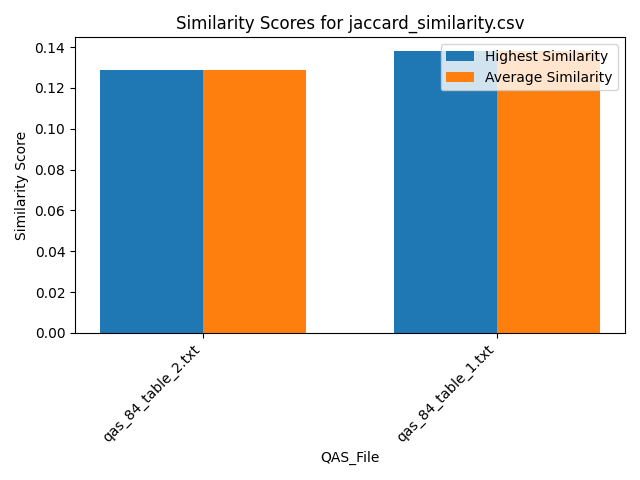

## Similarity Scores for jaccard_similarity.csv

## Similarity Scores for jaccard_similarity.csv
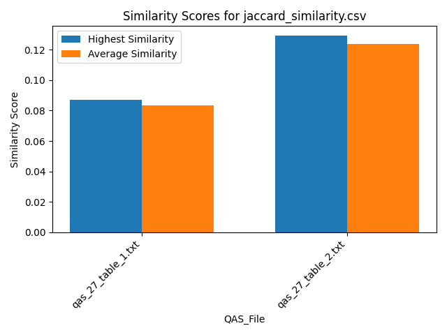

## Similarity Scores for jaccard_similarity.csv

## Similarity Scores for jaccard_similarity.csv

## Similarity Scores for jaccard_similarity.csv

## Similarity Scores for jaccard_similarity.csv

## Similarity Scores for jaccard_similarity.csv

## Similarity Scores for jaccard_similarity.csv

## Similarity Scores for jaccard_similarity.csv

## Similarity Scores for jaccard_similarity.csv

## Similarity Scores for jaccard_similarity.csv

## Similarity Scores for jaccard_similarity.csv

## Similarity Scores for jaccard_similarity.csv

## Similarity Scores for jaccard_similarity.csv

## Similarity Scores for jaccard_similarity.csv

## Similarity Scores for jaccard_similarity.csv

## Similarity Scores for jaccard_similarity.csv

## Similarity Scores for jaccard_similarity.csv
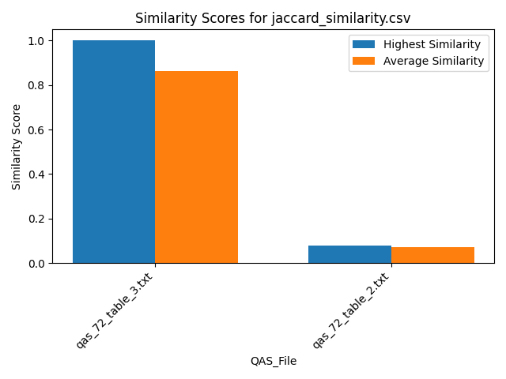

## Similarity Scores for jaccard_similarity.csv

## Similarity Scores for jaccard_similarity.csv

## Similarity Scores for jaccard_similarity.csv

## Similarity Scores for jaccard_similarity.csv

## Similarity Scores for jaccard_similarity.csv

## Similarity Scores for jaccard_similarity.csv
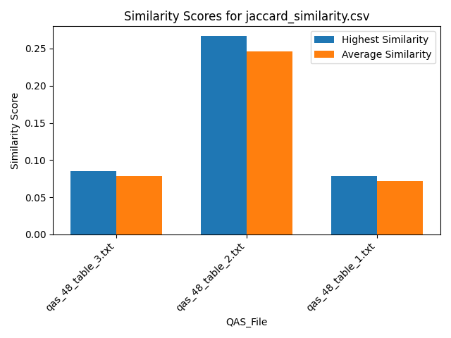

## Similarity Scores for jaccard_similarity.csv

## Similarity Scores for jaccard_similarity.csv

## Similarity Scores for jaccard_similarity.csv
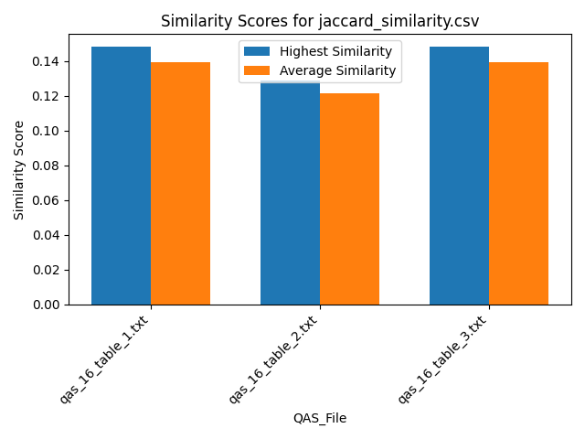

## Similarity Scores for jaccard_similarity.csv

## Similarity Scores for jaccard_similarity.csv

## Similarity Scores for jaccard_similarity.csv

## Similarity Scores for jaccard_similarity.csv

## Similarity Scores for jaccard_similarity.csv
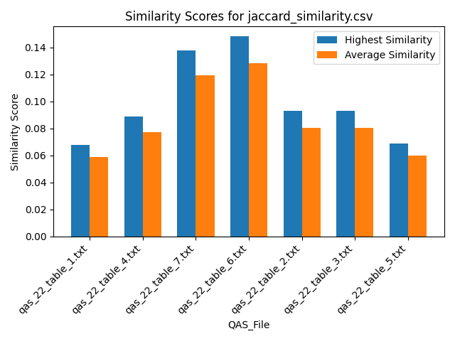

## Similarity Scores for jaccard_similarity.csv

## Similarity Scores for jaccard_similarity.csv

## Similarity Scores for jaccard_similarity.csv

## Similarity Scores for jaccard_similarity.csv

## Similarity Scores for jaccard_similarity.csv

## Similarity Scores for jaccard_similarity.csv

## Similarity Scores for jaccard_similarity.csv

## Similarity Scores for jaccard_similarity.csv

## Similarity Scores for jaccard_similarity.csv
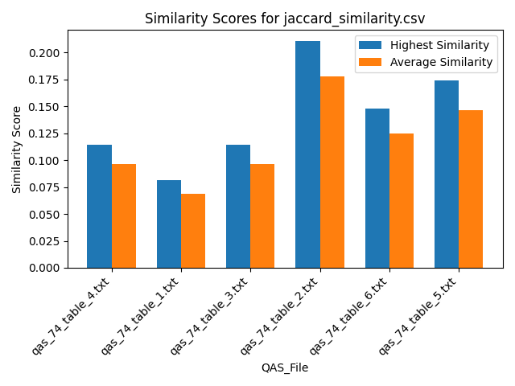

## Similarity Scores for jaccard_similarity.csv

## Similarity Scores for jaccard_similarity.csv

## Similarity Scores for jaccard_similarity.csv

## Similarity Scores for jaccard_similarity.csv

## Similarity Scores for jaccard_similarity.csv

## Similarity Scores for jaccard_similarity.csv

## Similarity Scores for jaccard_similarity.csv

## Similarity Scores for jaccard_similarity.csv

## Similarity Scores for jaccard_similarity.csv

## Similarity Scores for jaccard_similarity.csv

## Similarity Scores for jaccard_similarity.csv

## Similarity Scores for jaccard_similarity.csv

## Similarity Scores for jaccard_similarity.csv

## Similarity Scores for jaccard_similarity.csv

## Similarity Scores for jaccard_similarity.csv

## Similarity Scores for jaccard_similarity.csv

## Summary Table
| QAS_File            |   Average Cosine |   Highest Cosine |   Median Cosine |   Average Jaccard |   Highest Jaccard |   Median Jaccard |
|:--------------------|-----------------:|-----------------:|----------------:|------------------:|------------------:|-----------------:|
| All                 |        0.0787955 |        0.366784  |       0.0616357 |         0.192458  |         1         |        0.116379  |
| qas_40_table_1.txt  |        0.0514518 |        0.060231  |       0.0514518 |         0.0703704 |         0.0740741 |        0.0703704 |
| qas_64_table_1.txt  |        0.196396  |        0.233366  |       0.196396  |         0.75      |         0.75      |        0.75      |
| qas_58_table_1.txt  |        0.0547063 |        0.0717788 |       0.0547063 |         0.0540541 |         0.0540541 |        0.0540541 |
| qas_85_table_1.txt  |        0.0488371 |        0.0551239 |       0.0488371 |         0.06469   |         0.0754717 |        0.06469   |
| qas_85_table_3.txt  |        0.0555437 |        0.065384  |       0.0555437 |         0.0979592 |         0.114286  |        0.0979592 |
| qas_85_table_2.txt  |        0.0494932 |        0.0556033 |       0.0494932 |         0.0612245 |         0.0714286 |        0.0612245 |
| qas_33_table_1.txt  |        0.148263  |        0.207964  |       0.148263  |         0.571429  |         0.571429  |        0.571429  |
| qas_46_table_1.txt  |        0.0535226 |        0.0617977 |       0.0535226 |         0.08      |         0.08      |        0.08      |
| qas_20_table_1.txt  |        0.070124  |        0.0823806 |       0.070124  |         0.142857  |         0.142857  |        0.142857  |
| qas_94_table_1.txt  |        0.0463606 |        0.0517449 |       0.0463606 |         0.0493827 |         0.0493827 |        0.0493827 |
| qas_66_table_1.txt  |        0.0696301 |        0.108257  |       0.0696301 |         0.2       |         0.210526  |        0.2       |
| qas_100_table_1.txt |        0.0719539 |        0.0832642 |       0.0719539 |         0.123656  |         0.129032  |        0.123656  |
| qas_70_table_3.txt  |        0.0933638 |        0.115974  |       0.0933638 |         0.15942   |         0.173913  |        0.15942   |
| qas_70_table_1.txt  |        0.065368  |        0.081517  |       0.065368  |         0.0916667 |         0.1       |        0.0916667 |
| qas_79_table_1.txt  |        0.0943978 |        0.103046  |       0.0943978 |         0.137931  |         0.137931  |        0.137931  |
| qas_38_table_1.txt  |        0.0569002 |        0.063714  |       0.0569002 |         0.0765306 |         0.0816327 |        0.0765306 |
| qas_84_table_2.txt  |        0.0657679 |        0.0899907 |       0.0657679 |         0.129032  |         0.129032  |        0.129032  |
| qas_84_table_1.txt  |        0.0641342 |        0.0711148 |       0.0641342 |         0.137931  |         0.137931  |        0.137931  |
| qas_67_table_1.txt  |        0.0330315 |        0.035042  |       0.0330315 |         0.0588235 |         0.0588235 |        0.0588235 |
| qas_27_table_1.txt  |        0.0444801 |        0.0586922 |       0.0444801 |         0.0833333 |         0.0869565 |        0.0833333 |
| qas_27_table_2.txt  |        0.0539873 |        0.0618043 |       0.0539873 |         0.123656  |         0.129032  |        0.123656  |
| qas_91_table_1.txt  |        0.0499946 |        0.0701833 |       0.0499946 |         0.0930233 |         0.0930233 |        0.0930233 |
| qas_17_table_1.txt  |        0.0586206 |        0.0746995 |       0.0586206 |         0.0844444 |         0.0888889 |        0.0844444 |
| qas_63_table_1.txt  |        0.0697861 |        0.0762195 |       0.0697861 |         0.0888889 |         0.0888889 |        0.0888889 |
| qas_12_table_1.txt  |        0.0513217 |        0.0559399 |       0.0513217 |         0.075     |         0.08      |        0.075     |
| qas_59_table_1.txt  |        0.0537409 |        0.0583019 |       0.0537409 |         0.125     |         0.142857  |        0.125     |
| qas_59_table_2.txt  |        0.0635925 |        0.100515  |       0.0635925 |         0.152174  |         0.173913  |        0.152174  |
| qas_77_table_1.txt  |        0.0395171 |        0.054444  |       0.0395171 |         0.0833333 |         0.0833333 |        0.0833333 |
| qas_47_table_1.txt  |        0.205653  |        0.28384   |       0.205653  |         0.8125    |         1         |        0.8125    |
| qas_57_table_1.txt  |        0.0532926 |        0.0620681 |       0.0532926 |         0.142857  |         0.142857  |        0.142857  |
| qas_62_table_2.txt  |        0.167638  |        0.18565   |       0.167638  |         0.542857  |         0.571429  |        0.542857  |
| qas_36_table_1.txt  |        0.126471  |        0.171889  |       0.126471  |         0.345455  |         0.363636  |        0.345455  |
| qas_61_table_1.txt  |        0.0472898 |        0.0669523 |       0.0472898 |         0.0555556 |         0.057971  |        0.0555556 |
| qas_39_table_2.txt  |        0.0561104 |        0.0685116 |       0.0561104 |         0.0880682 |         0.0909091 |        0.0880682 |
| qas_39_table_1.txt  |        0.0527408 |        0.074988  |       0.0527408 |         0.0901163 |         0.0930233 |        0.0901163 |
| qas_87_table_11.txt |        0.0771364 |        0.0873612 |       0.0771364 |         0.103226  |         0.129032  |        0.103226  |
| qas_87_table_13.txt |        0.0586388 |        0.0877691 |       0.0586388 |         0.1       |         0.125     |        0.1       |
| qas_87_table_3.txt  |        0.0454564 |        0.0583171 |       0.0454564 |         0.0571429 |         0.0714286 |        0.0571429 |
| qas_87_table_6.txt  |        0.073653  |        0.0956779 |       0.073653  |         0.118519  |         0.148148  |        0.118519  |
| qas_87_table_8.txt  |        0.0511375 |        0.0559706 |       0.0511375 |         0.0695652 |         0.0869565 |        0.0695652 |
| qas_87_table_10.txt |        0.0484203 |        0.0546508 |       0.0484203 |         0.0653061 |         0.0816327 |        0.0653061 |
| qas_87_table_15.txt |        0.0500241 |        0.0568093 |       0.0500241 |         0.0680851 |         0.0851064 |        0.0680851 |
| qas_87_table_12.txt |        0.098883  |        0.116531  |       0.098883  |         0.13913   |         0.173913  |        0.13913   |
| qas_87_table_9.txt  |        0.0442233 |        0.0502147 |       0.0442233 |         0.0666667 |         0.0833333 |        0.0666667 |
| qas_87_table_1.txt  |        0.0576063 |        0.0650857 |       0.0576063 |         0.0711111 |         0.0888889 |        0.0711111 |
| qas_87_table_4.txt  |        0.0431201 |        0.0489919 |       0.0431201 |         0.0615385 |         0.0769231 |        0.0615385 |
| qas_87_table_2.txt  |        0.0552581 |        0.0732036 |       0.0552581 |         0.0666667 |         0.0833333 |        0.0666667 |
| qas_87_table_5.txt  |        0.0600443 |        0.0754796 |       0.0600443 |         0.0914286 |         0.114286  |        0.0914286 |
| qas_87_table_14.txt |        0.0672664 |        0.0770834 |       0.0672664 |         0.103226  |         0.129032  |        0.103226  |
| qas_87_table_7.txt  |        0.079516  |        0.108193  |       0.079516  |         0.13913   |         0.173913  |        0.13913   |
| qas_32_table_1.txt  |        0.0408111 |        0.0571303 |       0.0408111 |         0.0851064 |         0.0851064 |        0.0851064 |
| qas_18_table_1.txt  |        0.073252  |        0.106558  |       0.073252  |         0.137566  |         0.148148  |        0.137566  |
| qas_72_table_3.txt  |        0.270221  |        0.366784  |       0.270221  |         0.863636  |         1         |        0.863636  |
| qas_72_table_2.txt  |        0.0428616 |        0.0583914 |       0.0428616 |         0.0709091 |         0.08      |        0.0709091 |
| qas_68_table_1.txt  |        0.0697403 |        0.0765308 |       0.0697403 |         0.135802  |         0.148148  |        0.135802  |
| qas_26_table_1.txt  |        0.0417845 |        0.0572759 |       0.0417845 |         0.0615385 |         0.0615385 |        0.0615385 |
| qas_35_table_1.txt  |        0.227986  |        0.298366  |       0.227986  |         0.8125    |         1         |        0.8125    |
| qas_21_table_1.txt  |        0.0495841 |        0.0627565 |       0.0495841 |         0.046332  |         0.0540541 |        0.046332  |
| qas_98_table_5.txt  |        0.096481  |        0.120501  |       0.096481  |         0.210526  |         0.210526  |        0.210526  |
| qas_98_table_3.txt  |        0.0654896 |        0.0858669 |       0.0654896 |         0.148148  |         0.148148  |        0.148148  |
| qas_48_table_3.txt  |        0.0586063 |        0.0800158 |       0.0586063 |         0.0784574 |         0.0851064 |        0.0784574 |
| qas_48_table_2.txt  |        0.0989008 |        0.127857  |       0.0989008 |         0.245833  |         0.266667  |        0.245833  |
| qas_48_table_1.txt  |        0.0538526 |        0.0728865 |       0.0538526 |         0.0723039 |         0.0784314 |        0.0723039 |
| qas_60_table_1.txt  |        0.206287  |        0.250713  |       0.206287  |         0.777778  |         1         |        0.777778  |
| qas_83_table_1.txt  |        0.202339  |        0.242161  |       0.202339  |         0.791667  |         1         |        0.791667  |
| qas_16_table_1.txt  |        0.0724694 |        0.101447  |       0.0724694 |         0.139506  |         0.148148  |        0.139506  |
| qas_16_table_2.txt  |        0.0648881 |        0.098262  |       0.0648881 |         0.121505  |         0.129032  |        0.121505  |
| qas_16_table_3.txt  |        0.0750997 |        0.103887  |       0.0750997 |         0.139506  |         0.148148  |        0.139506  |
| qas_82_table_1.txt  |        0.0419017 |        0.0541119 |       0.0419017 |         0.0727763 |         0.0754717 |        0.0727763 |
| qas_88_table_1.txt  |        0.0609114 |        0.0792007 |       0.0609114 |         0.0883721 |         0.0930233 |        0.0883721 |
| qas_9_table_2.txt   |        0.0949315 |        0.114086  |       0.0949315 |         0.237037  |         0.266667  |        0.237037  |
| qas_9_table_1.txt   |        0.0701146 |        0.0767417 |       0.0701146 |         0.131687  |         0.148148  |        0.131687  |
| qas_9_table_3.txt   |        0.2116    |        0.248843  |       0.2116    |         0.861111  |         1         |        0.861111  |
| qas_92_table_1.txt  |        0.0509878 |        0.0619726 |       0.0509878 |         0.173913  |         0.173913  |        0.173913  |
| qas_22_table_1.txt  |        0.057795  |        0.07861   |       0.057795  |         0.0588235 |         0.0677966 |        0.0588235 |
| qas_22_table_4.txt  |        0.0572902 |        0.0848958 |       0.0572902 |         0.0771242 |         0.0888889 |        0.0771242 |
| qas_22_table_7.txt  |        0.0666362 |        0.0788639 |       0.0666362 |         0.119675  |         0.137931  |        0.119675  |
| qas_22_table_6.txt  |        0.0681382 |        0.0815831 |       0.0681382 |         0.12854   |         0.148148  |        0.12854   |
| qas_22_table_2.txt  |        0.0550844 |        0.0795314 |       0.0550844 |         0.0807114 |         0.0930233 |        0.0807114 |
| qas_22_table_3.txt  |        0.0659487 |        0.0957441 |       0.0659487 |         0.0807114 |         0.0930233 |        0.0807114 |
| qas_22_table_5.txt  |        0.0440995 |        0.0508651 |       0.0440995 |         0.0598377 |         0.0689655 |        0.0598377 |
| qas_29_table_1.txt  |        0.0643886 |        0.0720174 |       0.0643886 |         0.165217  |         0.173913  |        0.165217  |
| qas_90_table_3.txt  |        0.133167  |        0.15462   |       0.133167  |         0.507937  |         0.571429  |        0.507937  |
| qas_90_table_1.txt  |        0.0739069 |        0.10398   |       0.0739069 |         0.154589  |         0.173913  |        0.154589  |
| qas_90_table_2.txt  |        0.0542119 |        0.0637947 |       0.0542119 |         0.111111  |         0.125     |        0.111111  |
| qas_37_table_1.txt  |        0.0834167 |        0.0951724 |       0.0834167 |         0.19      |         0.2       |        0.19      |
| qas_76_table_1.txt  |        0.0596971 |        0.075425  |       0.0596971 |         0.0961538 |         0.102564  |        0.0961538 |
| qas_56_table_2.txt  |        0.147615  |        0.184005  |       0.147615  |         0.559524  |         0.571429  |        0.559524  |
| qas_56_table_1.txt  |        0.129467  |        0.199739  |       0.129467  |         0.559524  |         0.571429  |        0.559524  |
| qas_23_table_1.txt  |        0.0675311 |        0.0796666 |       0.0675311 |         0.0701754 |         0.0701754 |        0.0701754 |
| qas_44_table_1.txt  |        0.0763226 |        0.0800009 |       0.0763226 |         0.132275  |         0.148148  |        0.132275  |
| qas_44_table_2.txt  |        0.066663  |        0.0755964 |       0.066663  |         0.15528   |         0.173913  |        0.15528   |
| qas_34_table_1.txt  |        0.0445258 |        0.0677821 |       0.0445258 |         0.114478  |         0.121212  |        0.114478  |
| qas_74_table_4.txt  |        0.05988   |        0.0760021 |       0.05988   |         0.0964286 |         0.114286  |        0.0964286 |
| qas_74_table_1.txt  |        0.0588899 |        0.0757739 |       0.0588899 |         0.0688776 |         0.0816327 |        0.0688776 |
| qas_74_table_3.txt  |        0.0632547 |        0.0785813 |       0.0632547 |         0.0964286 |         0.114286  |        0.0964286 |
| qas_74_table_2.txt  |        0.0767197 |        0.0957617 |       0.0767197 |         0.177632  |         0.210526  |        0.177632  |
| qas_74_table_6.txt  |        0.0803659 |        0.0992079 |       0.0803659 |         0.125     |         0.148148  |        0.125     |
| qas_74_table_5.txt  |        0.0894939 |        0.110589  |       0.0894939 |         0.146739  |         0.173913  |        0.146739  |
| qas_99_table_3.txt  |        0.0783215 |        0.103366  |       0.0783215 |         0.142857  |         0.142857  |        0.142857  |
| qas_99_table_1.txt  |        0.0857661 |        0.115608  |       0.0857661 |         0.210526  |         0.210526  |        0.210526  |
| qas_99_table_2.txt  |        0.0708922 |        0.0866488 |       0.0708922 |         0.137931  |         0.137931  |        0.137931  |
| qas_81_table_3.txt  |        0.135837  |        0.187984  |       0.135837  |         0.535714  |         0.571429  |        0.535714  |
| qas_81_table_4.txt  |        0.213694  |        0.295815  |       0.213694  |         0.8125    |         1         |        0.8125    |
| qas_81_table_2.txt  |        0.040998  |        0.0602084 |       0.040998  |         0.0872093 |         0.0930233 |        0.0872093 |
| qas_81_table_1.txt  |        0.0365307 |        0.0508485 |       0.0365307 |         0.0520833 |         0.0555556 |        0.0520833 |
| qas_43_table_1.txt  |        0.183383  |        0.279357  |       0.183383  |         0.75      |         0.75      |        0.75      |
| qas_45_table_1.txt  |        0.0440548 |        0.0475986 |       0.0440548 |         0.059375  |         0.0625    |        0.059375  |
| qas_89_table_1.txt  |        0.0591768 |        0.0795276 |       0.0591768 |         0.148148  |         0.148148  |        0.148148  |
| qas_10_table_1.txt  |        0.0483939 |        0.0589944 |       0.0483939 |         0.0820669 |         0.0851064 |        0.0820669 |
| qas_13_table_1.txt  |        0.0575148 |        0.0623463 |       0.0575148 |         0.1       |         0.105263  |        0.1       |
| qas_95_table_1.txt  |        0.0541869 |        0.0635392 |       0.0541869 |         0.0689655 |         0.0689655 |        0.0689655 |
| qas_19_table_1.txt  |        0.209329  |        0.244653  |       0.209329  |         0.8       |         1         |        0.8       |
| qas_31_table_1.txt  |        0.0574474 |        0.0761539 |       0.0574474 |         0.0763889 |         0.0833333 |        0.0763889 |
| qas_69_table_1.txt  |        0.0610665 |        0.0657658 |       0.0610665 |         0.114286  |         0.114286  |        0.114286  |
| qas_30_table_1.txt  |        0.0586434 |        0.0722651 |       0.0586434 |         0.148148  |         0.148148  |        0.148148  |
| qas_25_table_1.txt  |        0.151255  |        0.206892  |       0.151255  |         0.571429  |         0.571429  |        0.571429  |
| qas_71_table_1.txt  |        0.0533789 |        0.0677159 |       0.0533789 |         0.173913  |         0.173913  |        0.173913  |
| qas_14_table_2.txt  |        0.0604321 |        0.0725443 |       0.0604321 |         0.0852713 |         0.0930233 |        0.0852713 |
| qas_14_table_1.txt  |        0.0622049 |        0.073178  |       0.0622049 |         0.0780142 |         0.0851064 |        0.0780142 |
| qas_8_table_1.txt   |        0.0457844 |        0.0691499 |       0.0457844 |         0.11828   |         0.129032  |        0.11828   |
| qas_8_table_2.txt   |        0.0652902 |        0.0793896 |       0.0652902 |         0.126437  |         0.137931  |        0.126437  |

## Overview of Similarity Scores - Bars

## Overview of Similarity Scores - Lines

## Overview of Similarity Scores - Combined

