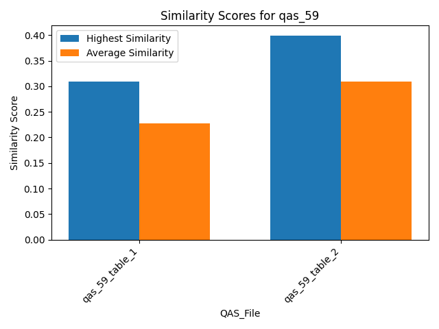

## Similarity Scores for qas_68

## Similarity Scores for qas_60

## Similarity Scores for qas_77

## Similarity Scores for qas_8

## Similarity Scores for qas_59

## Summary Table
| QAS_File       |   Average Cosine |   Highest Cosine |   Median Cosine |
|:---------------|-----------------:|-----------------:|----------------:|
| All            |         0.304852 |         0.549376 |        0.305079 |
| qas_68_table_1 |         0.360734 |         0.453841 |        0.360734 |
| qas_60_table_1 |         0.305079 |         0.417843 |        0.305079 |
| qas_77_table_1 |         0.389492 |         0.549376 |        0.389492 |
| qas_8_table_1  |         0.288916 |         0.393327 |        0.288916 |
| qas_8_table_2  |         0.253065 |         0.295497 |        0.253065 |
| qas_59_table_1 |         0.226824 |         0.309666 |        0.226824 |
| qas_59_table_2 |         0.309852 |         0.398827 |        0.309852 |

## Overview of Similarity Scores - Bars

## Overview of Similarity Scores - Lines

## Overview of Similarity Scores - Combined

## Additional Table
| instance_name   |   nr of tables |   nr of paragraphs |   nr of comparisons | URL                                      |
|:----------------|---------------:|-------------------:|--------------------:|:-----------------------------------------|
| instance_60     |              1 |                  9 |                   9 | https://en.wikipedia.org/?curid=55574451 |
| instance_68     |              1 |                  6 |                   6 | https://en.wikipedia.org/?curid=62638173 |
| instance_77     |              1 |                  5 |                   5 | https://en.wikipedia.org/?curid=56148746 |
| instance_59     |              2 |                  6 |                  12 | https://en.wikipedia.org/?curid=141876   |
| instance_8      |              2 |                  6 |                  12 | https://en.wikipedia.org/?curid=29816052 |

