## Similarity Scores for cosine_similarity.csv

## Similarity Scores for cosine_similarity.csv

## Similarity Scores for cosine_similarity.csv
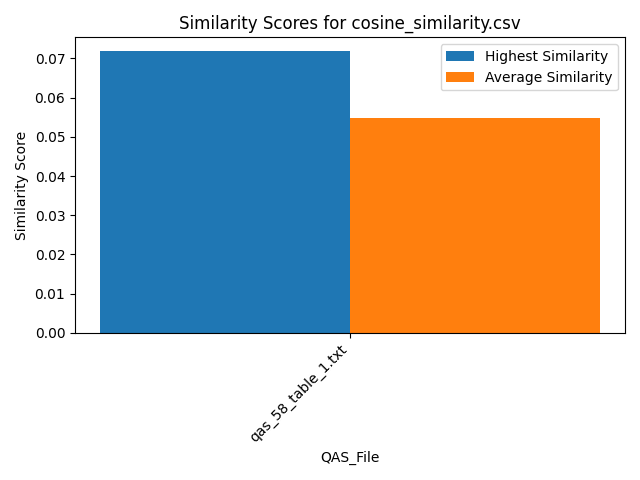

## Similarity Scores for cosine_similarity.csv
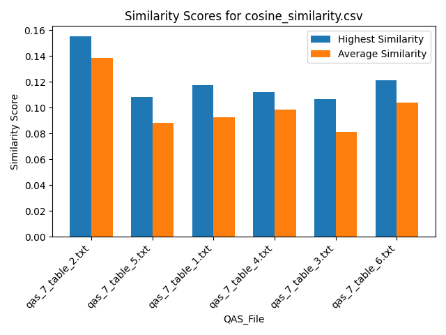

## Similarity Scores for cosine_similarity.csv

## Similarity Scores for cosine_similarity.csv
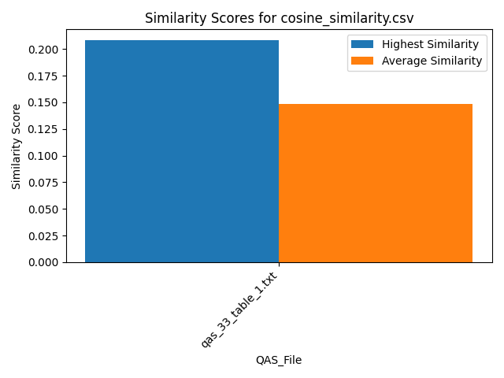

## Similarity Scores for cosine_similarity.csv

## Similarity Scores for cosine_similarity.csv
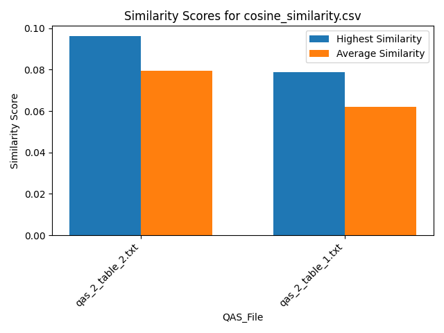

## Similarity Scores for cosine_similarity.csv

## Similarity Scores for cosine_similarity.csv
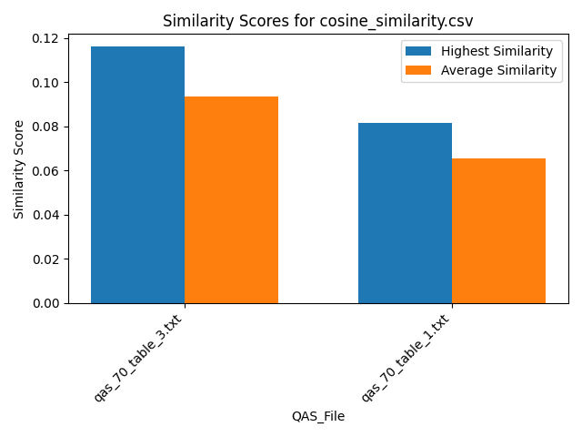

## Similarity Scores for cosine_similarity.csv
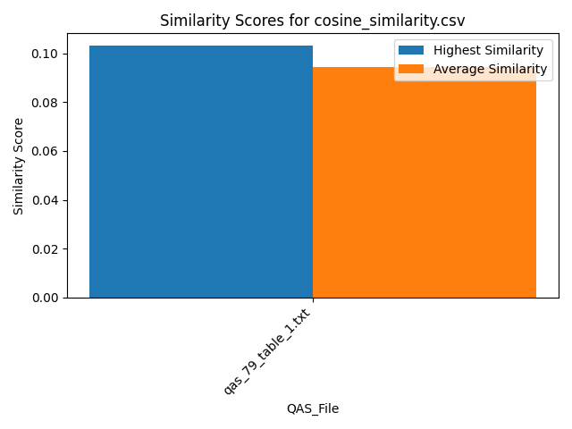

## Similarity Scores for cosine_similarity.csv
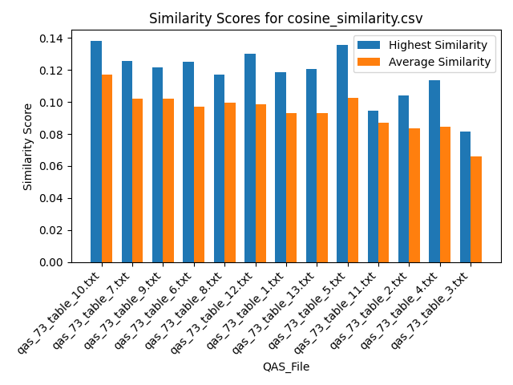

## Similarity Scores for cosine_similarity.csv
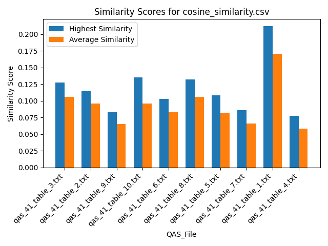

## Similarity Scores for cosine_similarity.csv
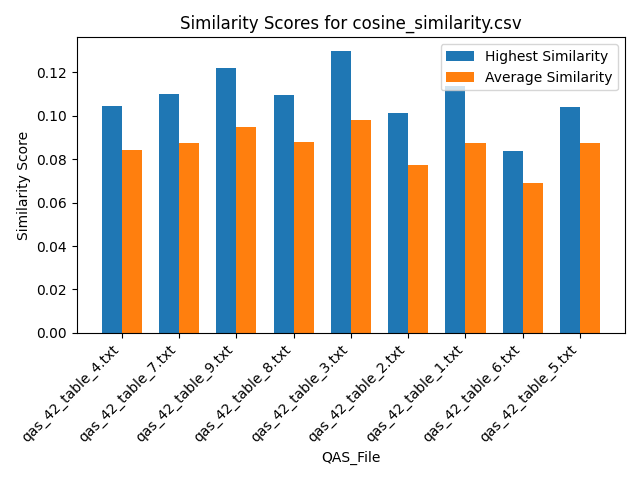

## Similarity Scores for cosine_similarity.csv

## Similarity Scores for cosine_similarity.csv

## Similarity Scores for cosine_similarity.csv
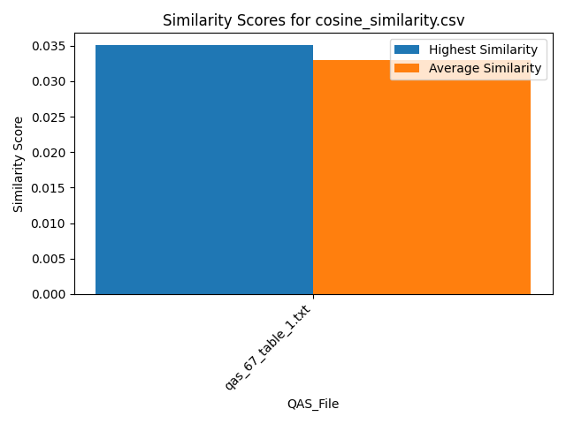

## Similarity Scores for cosine_similarity.csv
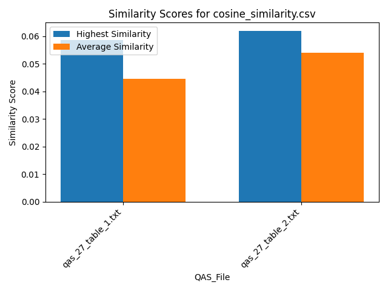

## Similarity Scores for cosine_similarity.csv
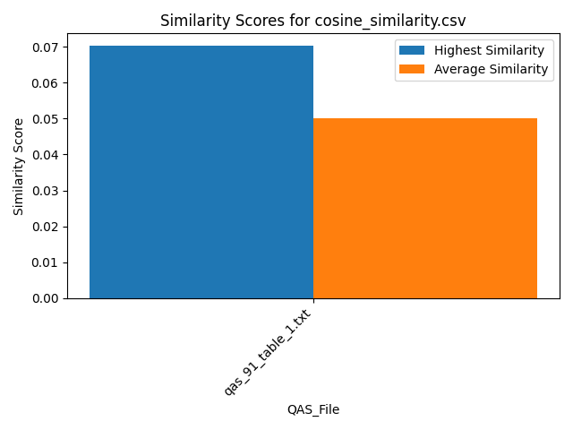

## Similarity Scores for cosine_similarity.csv

## Similarity Scores for cosine_similarity.csv

## Similarity Scores for cosine_similarity.csv

## Similarity Scores for cosine_similarity.csv

## Similarity Scores for cosine_similarity.csv
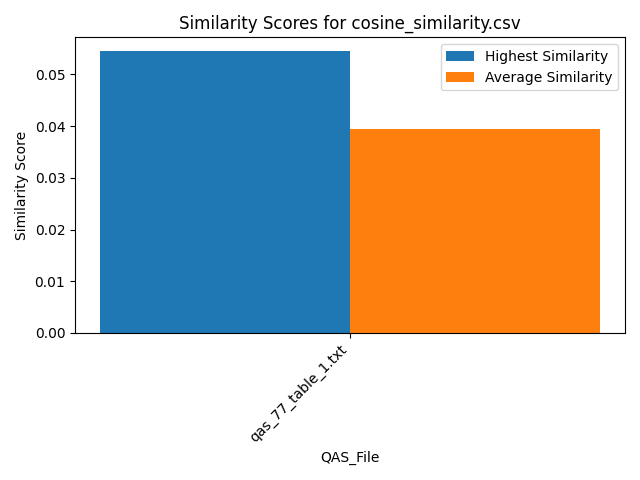

## Similarity Scores for cosine_similarity.csv

## Similarity Scores for cosine_similarity.csv

## Similarity Scores for cosine_similarity.csv
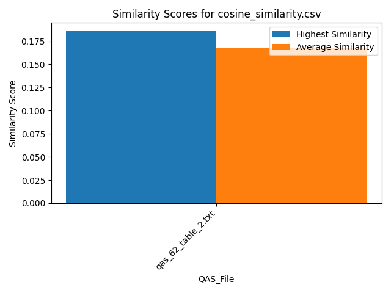

## Similarity Scores for cosine_similarity.csv

## Similarity Scores for cosine_similarity.csv

## Similarity Scores for cosine_similarity.csv

## Similarity Scores for cosine_similarity.csv
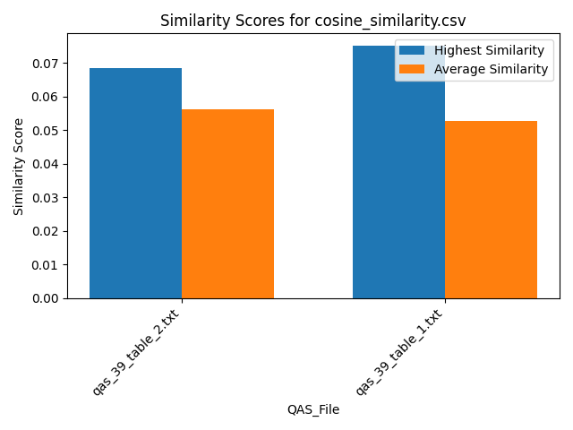

## Similarity Scores for cosine_similarity.csv

## Similarity Scores for cosine_similarity.csv
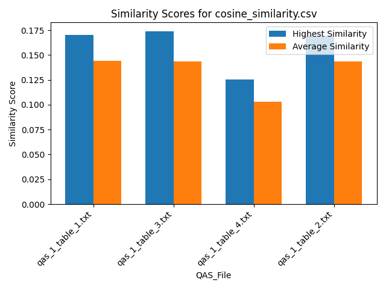

## Similarity Scores for cosine_similarity.csv

## Similarity Scores for cosine_similarity.csv
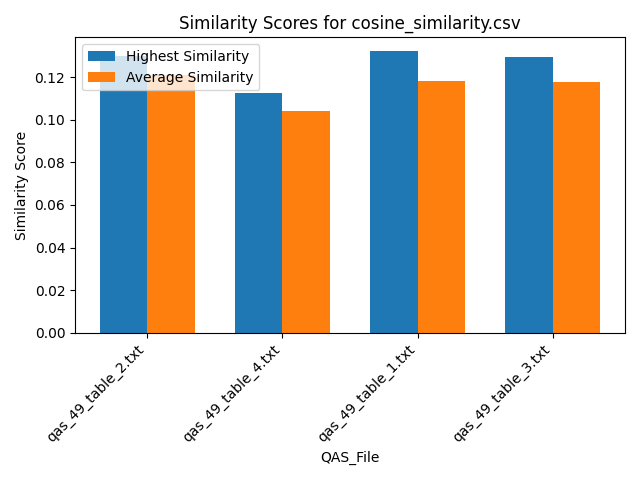

## Similarity Scores for cosine_similarity.csv

## Similarity Scores for cosine_similarity.csv

## Similarity Scores for cosine_similarity.csv

## Similarity Scores for cosine_similarity.csv

## Similarity Scores for cosine_similarity.csv
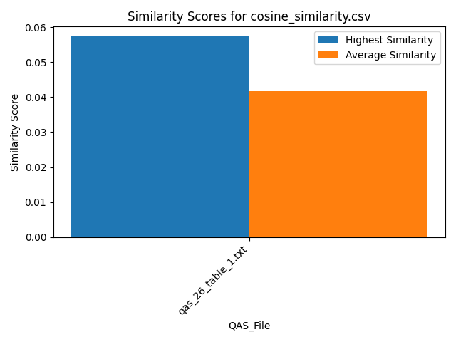

## Similarity Scores for cosine_similarity.csv

## Similarity Scores for cosine_similarity.csv
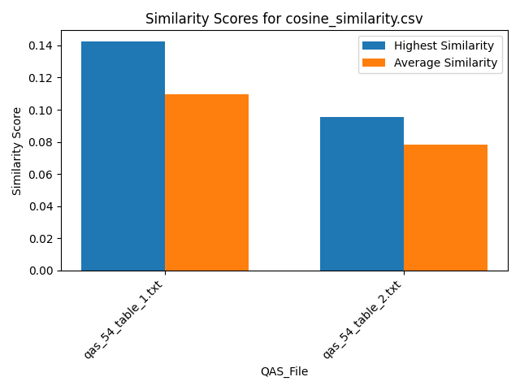

## Similarity Scores for cosine_similarity.csv

## Similarity Scores for cosine_similarity.csv

## Similarity Scores for cosine_similarity.csv
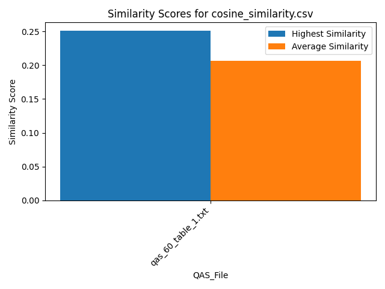

## Similarity Scores for cosine_similarity.csv
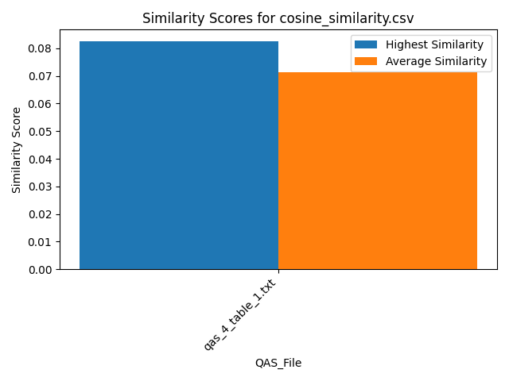

## Similarity Scores for cosine_similarity.csv

## Similarity Scores for cosine_similarity.csv
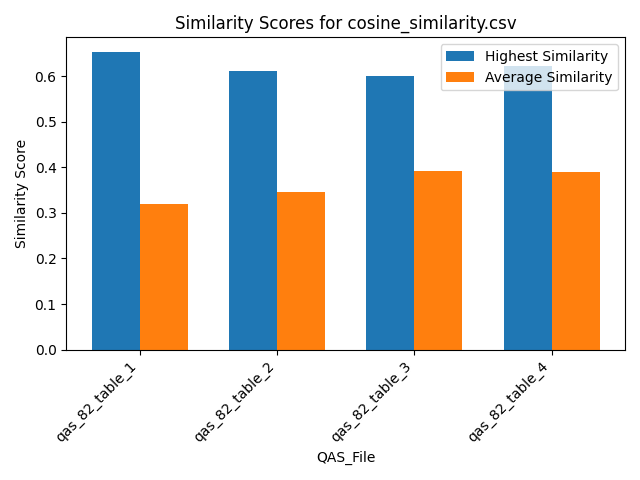

## Similarity Scores for cosine_similarity.csv

## Similarity Scores for cosine_similarity.csv
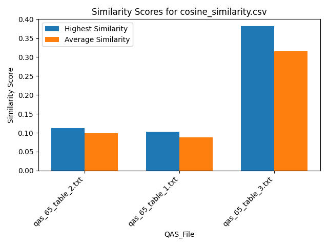

## Similarity Scores for cosine_similarity.csv

## Similarity Scores for cosine_similarity.csv

## Similarity Scores for cosine_similarity.csv

## Similarity Scores for cosine_similarity.csv
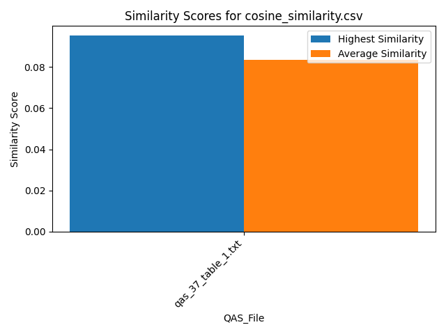

## Similarity Scores for cosine_similarity.csv

## Similarity Scores for cosine_similarity.csv

## Similarity Scores for cosine_similarity.csv

## Similarity Scores for cosine_similarity.csv

## Similarity Scores for cosine_similarity.csv

## Similarity Scores for cosine_similarity.csv
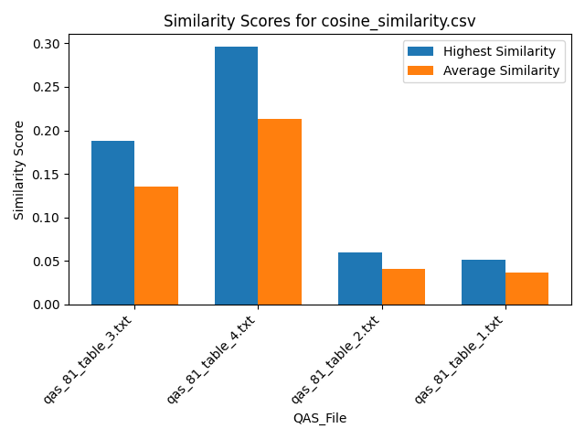

## Similarity Scores for cosine_similarity.csv

## Similarity Scores for cosine_similarity.csv
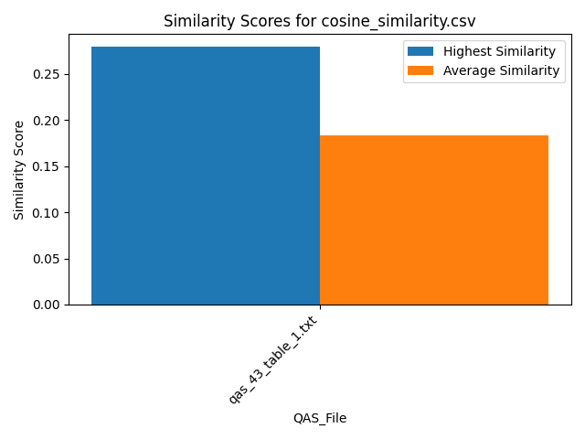

## Similarity Scores for cosine_similarity.csv
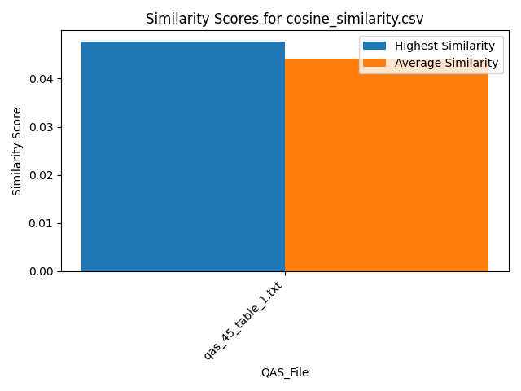

## Similarity Scores for cosine_similarity.csv
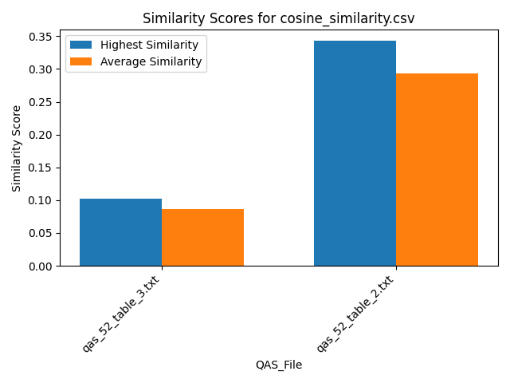

## Similarity Scores for cosine_similarity.csv

## Similarity Scores for cosine_similarity.csv
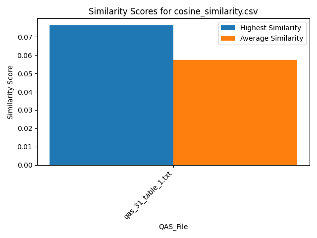

## Similarity Scores for cosine_similarity.csv
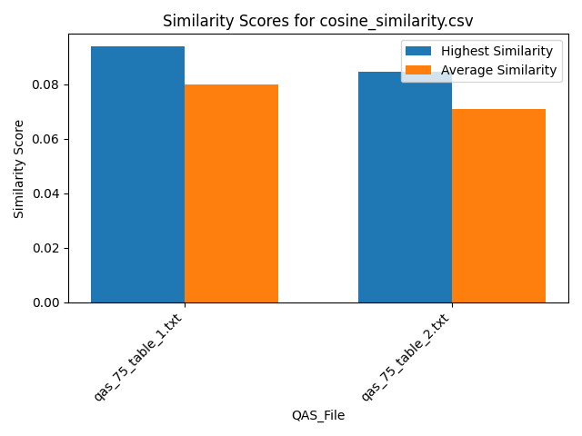

## Similarity Scores for cosine_similarity.csv

## Similarity Scores for cosine_similarity.csv

## Similarity Scores for cosine_similarity.csv

## Similarity Scores for cosine_similarity.csv
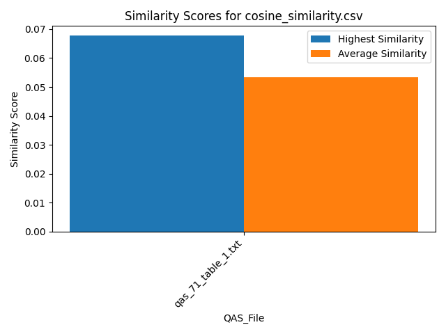

## Similarity Scores for cosine_similarity.csv
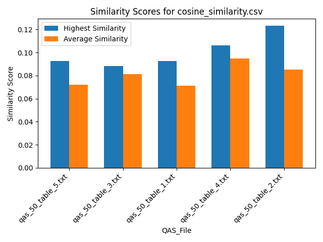

## Similarity Scores for jaccard_similarity.csv

## Similarity Scores for jaccard_similarity.csv

## Similarity Scores for jaccard_similarity.csv

## Similarity Scores for jaccard_similarity.csv

## Similarity Scores for jaccard_similarity.csv

## Similarity Scores for jaccard_similarity.csv

## Similarity Scores for jaccard_similarity.csv

## Similarity Scores for jaccard_similarity.csv

## Similarity Scores for jaccard_similarity.csv

## Similarity Scores for jaccard_similarity.csv

## Similarity Scores for jaccard_similarity.csv

## Similarity Scores for jaccard_similarity.csv
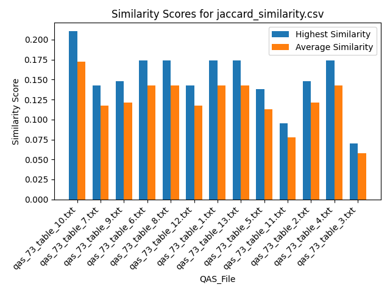

## Similarity Scores for jaccard_similarity.csv
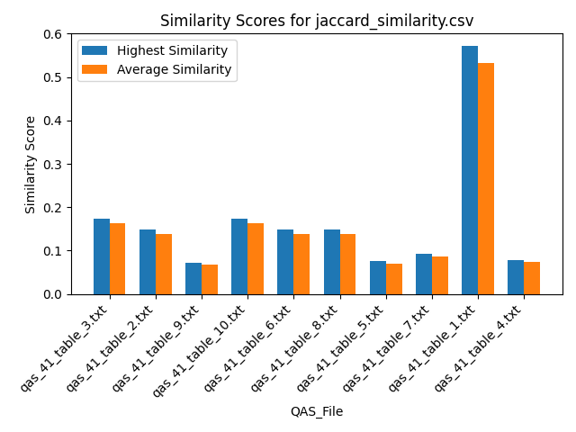

## Similarity Scores for jaccard_similarity.csv

## Similarity Scores for jaccard_similarity.csv

## Similarity Scores for jaccard_similarity.csv

## Similarity Scores for jaccard_similarity.csv

## Similarity Scores for jaccard_similarity.csv

## Similarity Scores for jaccard_similarity.csv

## Similarity Scores for jaccard_similarity.csv
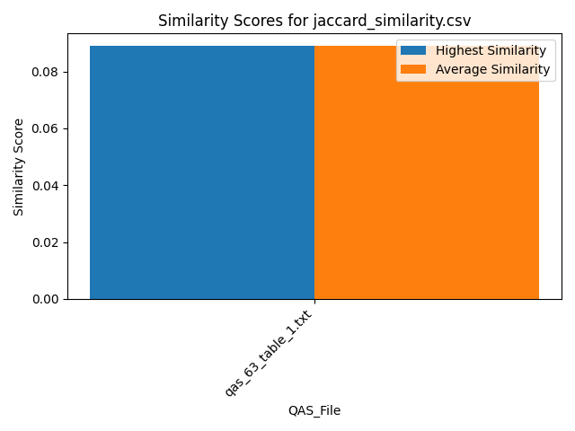

## Similarity Scores for jaccard_similarity.csv

## Similarity Scores for jaccard_similarity.csv
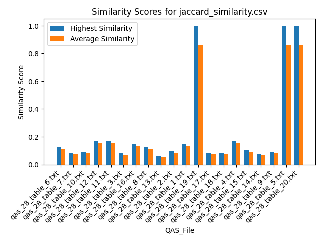

## Similarity Scores for jaccard_similarity.csv

## Similarity Scores for jaccard_similarity.csv

## Similarity Scores for jaccard_similarity.csv

## Similarity Scores for jaccard_similarity.csv

## Similarity Scores for jaccard_similarity.csv

## Similarity Scores for jaccard_similarity.csv

## Similarity Scores for jaccard_similarity.csv
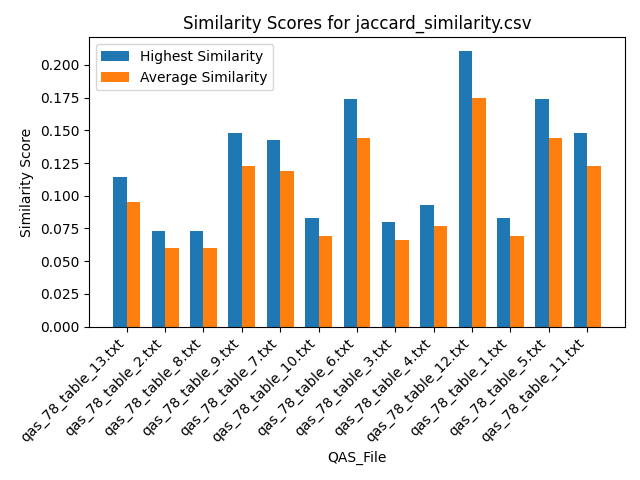

## Similarity Scores for jaccard_similarity.csv

## Similarity Scores for jaccard_similarity.csv
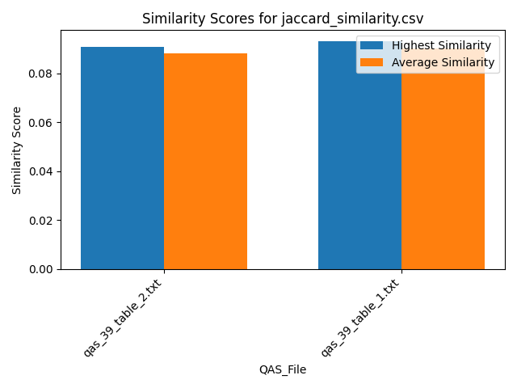

## Similarity Scores for jaccard_similarity.csv

## Similarity Scores for jaccard_similarity.csv
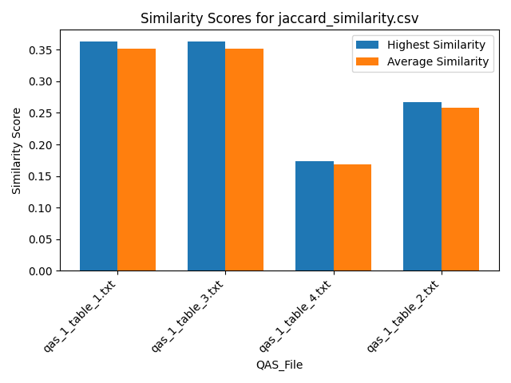

## Similarity Scores for jaccard_similarity.csv

## Similarity Scores for jaccard_similarity.csv

## Similarity Scores for jaccard_similarity.csv
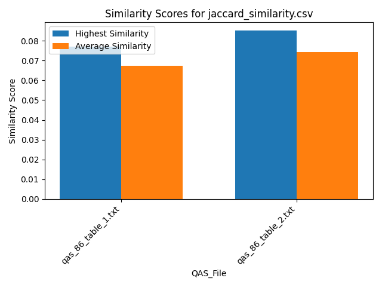

## Similarity Scores for jaccard_similarity.csv

## Similarity Scores for jaccard_similarity.csv

## Similarity Scores for jaccard_similarity.csv

## Similarity Scores for jaccard_similarity.csv

## Similarity Scores for jaccard_similarity.csv
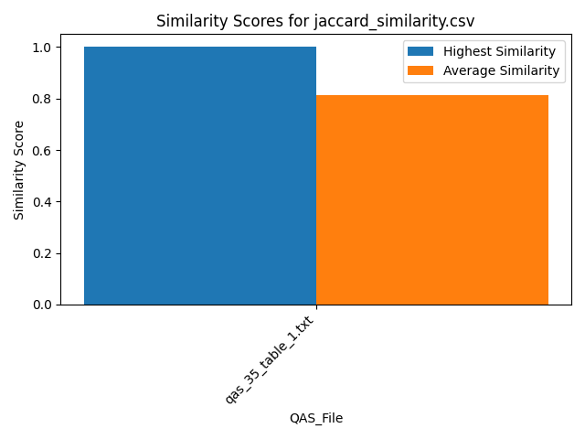

## Similarity Scores for jaccard_similarity.csv
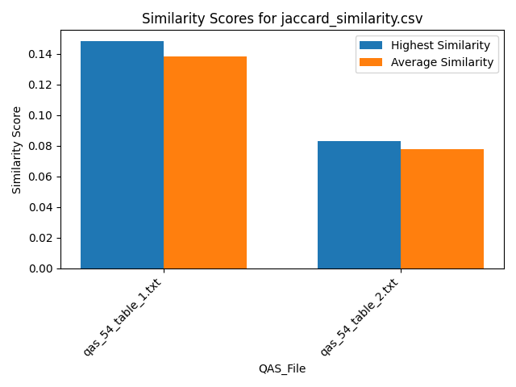

## Similarity Scores for jaccard_similarity.csv
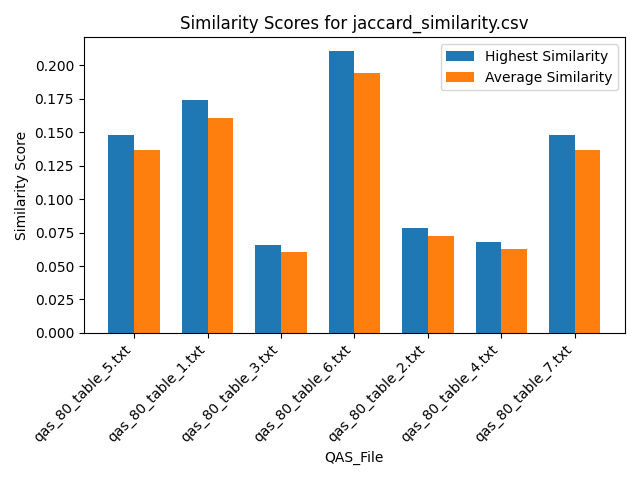

## Similarity Scores for jaccard_similarity.csv

## Similarity Scores for jaccard_similarity.csv

## Similarity Scores for jaccard_similarity.csv

## Similarity Scores for jaccard_similarity.csv

## Similarity Scores for jaccard_similarity.csv

## Similarity Scores for jaccard_similarity.csv
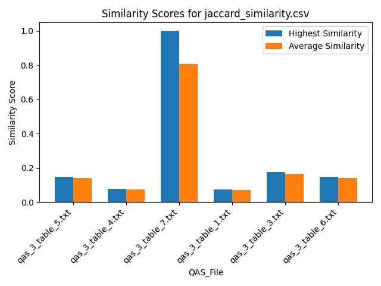

## Similarity Scores for jaccard_similarity.csv

## Similarity Scores for jaccard_similarity.csv

## Similarity Scores for jaccard_similarity.csv

## Similarity Scores for jaccard_similarity.csv

## Similarity Scores for jaccard_similarity.csv

## Similarity Scores for jaccard_similarity.csv

## Similarity Scores for jaccard_similarity.csv
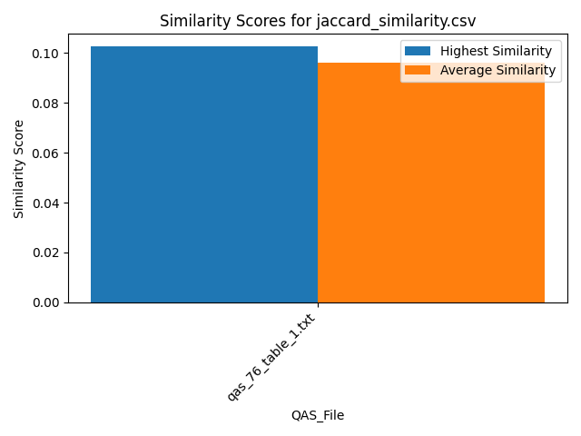

## Similarity Scores for jaccard_similarity.csv

## Similarity Scores for jaccard_similarity.csv
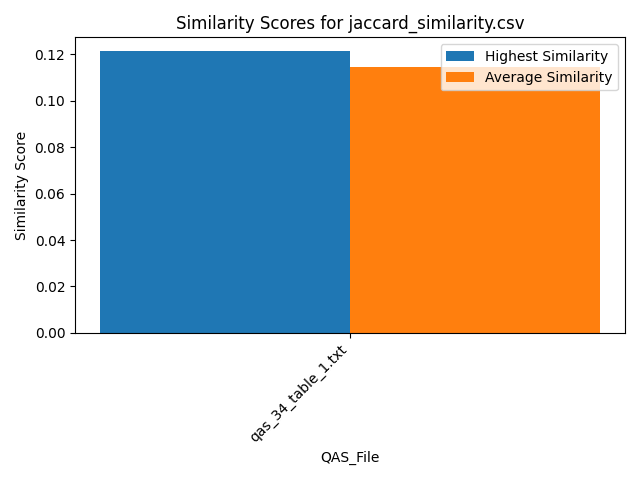

## Similarity Scores for jaccard_similarity.csv

## Similarity Scores for jaccard_similarity.csv

## Similarity Scores for jaccard_similarity.csv

## Similarity Scores for jaccard_similarity.csv

## Similarity Scores for jaccard_similarity.csv

## Similarity Scores for jaccard_similarity.csv
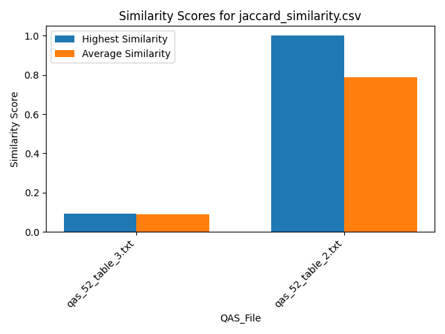

## Similarity Scores for jaccard_similarity.csv
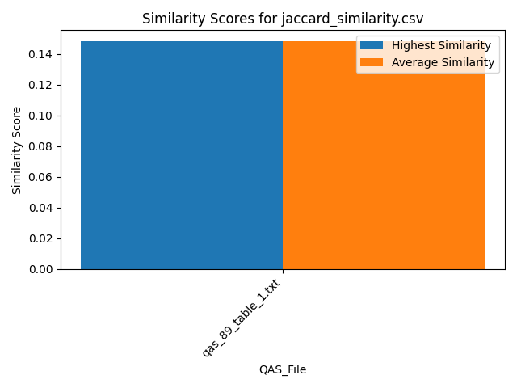

## Similarity Scores for jaccard_similarity.csv
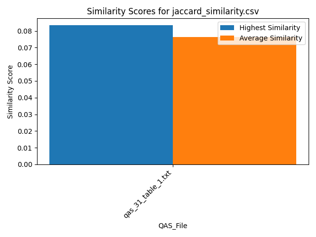

## Similarity Scores for jaccard_similarity.csv
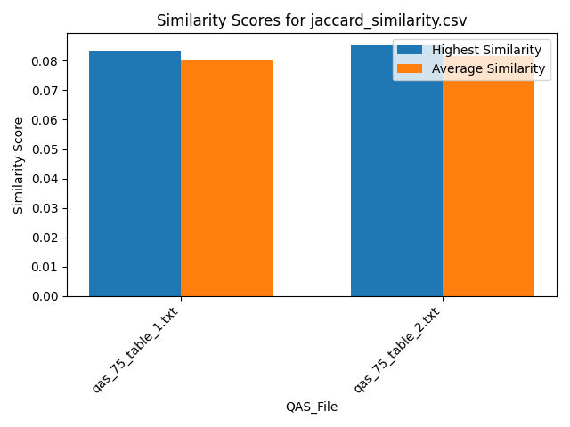

## Similarity Scores for jaccard_similarity.csv

## Similarity Scores for jaccard_similarity.csv

## Similarity Scores for jaccard_similarity.csv
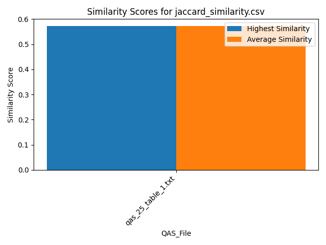

## Similarity Scores for jaccard_similarity.csv
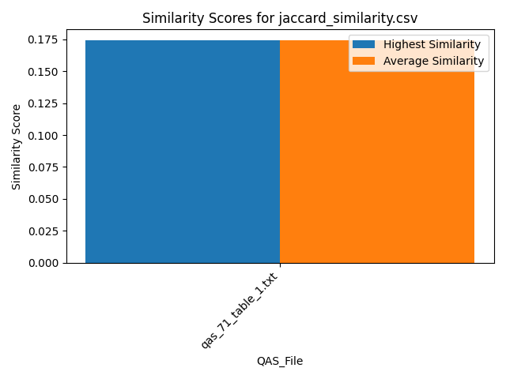

## Similarity Scores for jaccard_similarity.csv
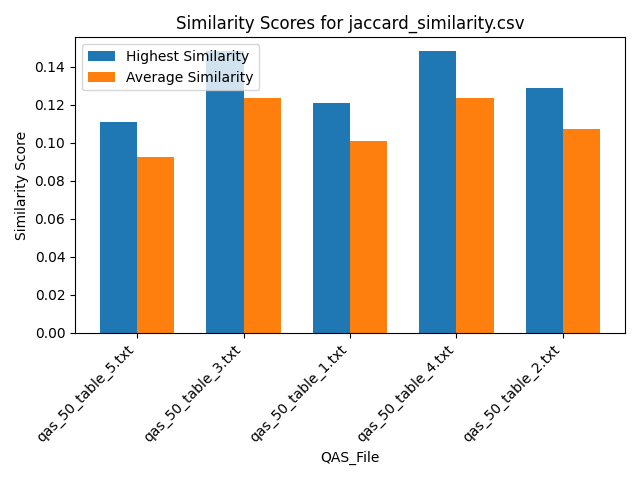

## Summary Table
| QAS_File            |   Average Cosine |   Highest Cosine |   Average Jaccard |   Highest Jaccard |
|:--------------------|-----------------:|-----------------:|------------------:|------------------:|
| All                 |        0.108542  |        0.457559  |         0.181143  |         1         |
| qas_40_table_1.txt  |        0.197821  |        0.226936  |         0.533333  |         0.571429  |
| qas_64_table_23.txt |        0.341044  |        0.418884  |         0.875     |         1         |
| qas_64_table_13.txt |        0.0872666 |        0.110294  |         0.1       |         0.114286  |
| qas_64_table_1.txt  |        0.0725494 |        0.0905236 |         0.0813953 |         0.0930233 |
| qas_64_table_24.txt |        0.334108  |        0.448095  |         0.875     |         1         |
| qas_64_table_5.txt  |        0.334108  |        0.448095  |         0.875     |         1         |
| qas_64_table_19.txt |        0.0875654 |        0.111239  |         0.112903  |         0.129032  |
| qas_64_table_7.txt  |        0.118468  |        0.139116  |         0.184211  |         0.210526  |
| qas_64_table_12.txt |        0.0989413 |        0.121065  |         0.12963   |         0.148148  |
| qas_64_table_3.txt  |        0.0922493 |        0.110784  |         0.0897436 |         0.102564  |
| qas_64_table_2.txt  |        0.0824791 |        0.101308  |         0.12963   |         0.148148  |
| qas_64_table_15.txt |        0.121741  |        0.150472  |         0.194444  |         0.222222  |
| qas_64_table_22.txt |        0.131939  |        0.159292  |         0.318182  |         0.363636  |
| qas_64_table_16.txt |        0.21987   |        0.272098  |         0.5       |         0.571429  |
| qas_64_table_11.txt |        0.101072  |        0.121678  |         0.112903  |         0.129032  |
| qas_64_table_17.txt |        0.240101  |        0.347895  |         0.875     |         1         |
| qas_64_table_9.txt  |        0.0995254 |        0.118692  |         0.112903  |         0.129032  |
| qas_64_table_21.txt |        0.0784778 |        0.0949881 |         0.0897436 |         0.102564  |
| qas_64_table_25.txt |        0.240101  |        0.347895  |         0.875     |         1         |
| qas_64_table_20.txt |        0.0637002 |        0.0849881 |         0.0729167 |         0.0833333 |
| qas_64_table_4.txt  |        0.334108  |        0.448095  |         0.875     |         1         |
| qas_64_table_8.txt  |        0.0869763 |        0.105182  |         0.112903  |         0.129032  |
| qas_64_table_18.txt |        0.0986743 |        0.131126  |         0.1       |         0.114286  |
| qas_64_table_14.txt |        0.237251  |        0.318382  |         0.875     |         1         |
| qas_64_table_10.txt |        0.0921621 |        0.11598   |         0.112903  |         0.129032  |
| qas_58_table_1.txt  |        0.32438   |        0.405139  |         0.818627  |         1         |
| qas_58_table_3.txt  |        0.104827  |        0.119455  |         0.161978  |         0.173913  |
| qas_7_table_2.txt   |        0.138616  |        0.155365  |         0.300699  |         0.363636  |
| qas_7_table_5.txt   |        0.0884221 |        0.108112  |         0.0893971 |         0.108108  |
| qas_7_table_1.txt   |        0.0923299 |        0.11757   |         0.114058  |         0.137931  |
| qas_7_table_4.txt   |        0.0985449 |        0.11173   |         0.122507  |         0.148148  |
| qas_7_table_3.txt   |        0.0813483 |        0.106438  |         0.0689103 |         0.0833333 |
| qas_7_table_6.txt   |        0.104107  |        0.120894  |         0.174089  |         0.210526  |
| qas_85_table_1.txt  |        0.085794  |        0.104346  |         0.121748  |         0.129032  |
| qas_85_table_3.txt  |        0.121325  |        0.136468  |         0.251613  |         0.266667  |
| qas_85_table_4.txt  |        0.208491  |        0.238675  |         0.539171  |         0.571429  |
| qas_85_table_2.txt  |        0.124783  |        0.140839  |         0.251613  |         0.266667  |
| qas_33_table_10.txt |        0.0880747 |        0.114094  |         0.101868  |         0.129032  |
| qas_33_table_7.txt  |        0.0833826 |        0.0945643 |         0.112782  |         0.142857  |
| qas_33_table_4.txt  |        0.086394  |        0.119525  |         0.101868  |         0.129032  |
| qas_33_table_15.txt |        0.102642  |        0.117601  |         0.210526  |         0.266667  |
| qas_33_table_12.txt |        0.107433  |        0.122267  |         0.112782  |         0.142857  |
| qas_33_table_14.txt |        0.0981757 |        0.112397  |         0.166205  |         0.210526  |
| qas_33_table_1.txt  |        0.0932506 |        0.104635  |         0.1373    |         0.173913  |
| qas_33_table_3.txt  |        0.0759546 |        0.096091  |         0.0902256 |         0.114286  |
| qas_33_table_11.txt |        0.090637  |        0.100752  |         0.075188  |         0.0952381 |
| qas_33_table_5.txt  |        0.108083  |        0.122341  |         0.166205  |         0.210526  |
| qas_33_table_6.txt  |        0.0977212 |        0.119142  |         0.105263  |         0.133333  |
| qas_33_table_9.txt  |        0.0823014 |        0.0916162 |         0.108893  |         0.137931  |
| qas_33_table_13.txt |        0.109238  |        0.12312   |         0.166205  |         0.210526  |
| qas_33_table_2.txt  |        0.0844007 |        0.124618  |         0.126316  |         0.16      |
| qas_33_table_8.txt  |        0.0840359 |        0.107813  |         0.105263  |         0.133333  |
| qas_46_table_7.txt  |        0.10311   |        0.119491  |         0.178947  |         0.210526  |
| qas_46_table_2.txt  |        0.0922894 |        0.10674   |         0.121429  |         0.142857  |
| qas_46_table_4.txt  |        0.0869765 |        0.104336  |         0.0871795 |         0.102564  |
| qas_46_table_8.txt  |        0.0916625 |        0.0996966 |         0.121429  |         0.142857  |
| qas_46_table_5.txt  |        0.0956257 |        0.12381   |         0.117241  |         0.137931  |
| qas_46_table_9.txt  |        0.10359   |        0.129218  |         0.136     |         0.16      |
| qas_46_table_1.txt  |        0.111492  |        0.135075  |         0.136     |         0.16      |
| qas_46_table_3.txt  |        0.109171  |        0.135352  |         0.117241  |         0.137931  |
| qas_46_table_6.txt  |        0.10087   |        0.117771  |         0.117241  |         0.137931  |
| qas_2_table_2.txt   |        0.0793598 |        0.0962955 |         0.0747059 |         0.08      |
| qas_2_table_1.txt   |        0.0621239 |        0.078933  |         0.0602467 |         0.0645161 |
| qas_66_table_1.txt  |        0.0823736 |        0.110103  |         0.0725806 |         0.0769231 |
| qas_70_table_6.txt  |        0.0911664 |        0.105244  |         0.136752  |         0.148148  |
| qas_70_table_10.txt |        0.101211  |        0.1208    |         0.136752  |         0.148148  |
| qas_70_table_2.txt  |        0.0998535 |        0.120012  |         0.136752  |         0.148148  |
| qas_70_table_9.txt  |        0.105215  |        0.124205  |         0.136752  |         0.148148  |
| qas_70_table_11.txt |        0.0564509 |        0.0664744 |         0.0723982 |         0.0784314 |
| qas_70_table_4.txt  |        0.0483286 |        0.0632279 |         0.0671329 |         0.0727273 |
| qas_70_table_3.txt  |        0.069077  |        0.0975454 |         0.105495  |         0.114286  |
| qas_70_table_7.txt  |        0.0967457 |        0.116179  |         0.160535  |         0.173913  |
| qas_70_table_1.txt  |        0.075477  |        0.0969137 |         0.0858676 |         0.0930233 |
| qas_70_table_5.txt  |        0.0462337 |        0.0619314 |         0.0625815 |         0.0677966 |
| qas_70_table_8.txt  |        0.0944018 |        0.113133  |         0.131868  |         0.142857  |
| qas_70_table_12.txt |        0.0617694 |        0.0731881 |         0.0723982 |         0.0784314 |
| qas_79_table_3.txt  |        0.10022   |        0.117234  |         0.139815  |         0.148148  |
| qas_79_table_5.txt  |        0.120362  |        0.14363   |         0.16413   |         0.173913  |
| qas_79_table_4.txt  |        0.111804  |        0.129756  |         0.139815  |         0.148148  |
| qas_73_table_10.txt |        0.117297  |        0.138071  |         0.172515  |         0.210526  |
| qas_73_table_7.txt  |        0.101824  |        0.125407  |         0.117063  |         0.142857  |
| qas_73_table_9.txt  |        0.101951  |        0.121684  |         0.121399  |         0.148148  |
| qas_73_table_6.txt  |        0.0972633 |        0.124986  |         0.142512  |         0.173913  |
| qas_73_table_8.txt  |        0.0996033 |        0.117262  |         0.142512  |         0.173913  |
| qas_73_table_12.txt |        0.0987859 |        0.130059  |         0.117063  |         0.142857  |
| qas_73_table_1.txt  |        0.0932591 |        0.118675  |         0.142512  |         0.173913  |
| qas_73_table_13.txt |        0.0928773 |        0.120447  |         0.142512  |         0.173913  |
| qas_73_table_5.txt  |        0.102541  |        0.135561  |         0.113027  |         0.137931  |
| qas_73_table_11.txt |        0.0872106 |        0.0945579 |         0.0780423 |         0.0952381 |
| qas_73_table_2.txt  |        0.0834022 |        0.104293  |         0.121399  |         0.148148  |
| qas_73_table_4.txt  |        0.084703  |        0.113533  |         0.142512  |         0.173913  |
| qas_73_table_3.txt  |        0.065972  |        0.0813229 |         0.0575049 |         0.0701754 |
| qas_41_table_3.txt  |        0.105702  |        0.127248  |         0.162122  |         0.173913  |
| qas_41_table_2.txt  |        0.0957501 |        0.114767  |         0.138104  |         0.148148  |
| qas_41_table_9.txt  |        0.0655636 |        0.0833086 |         0.0677966 |         0.0727273 |
| qas_41_table_10.txt |        0.0961437 |        0.135472  |         0.162122  |         0.173913  |
| qas_41_table_6.txt  |        0.0828321 |        0.10293   |         0.138104  |         0.148148  |
| qas_41_table_8.txt  |        0.106015  |        0.132004  |         0.138104  |         0.148148  |
| qas_41_table_5.txt  |        0.0820313 |        0.108201  |         0.070355  |         0.0754717 |
| qas_41_table_7.txt  |        0.066347  |        0.0860381 |         0.0867166 |         0.0930233 |
| qas_41_table_1.txt  |        0.170496  |        0.212221  |         0.532688  |         0.571429  |
| qas_41_table_4.txt  |        0.0585927 |        0.0771919 |         0.073114  |         0.0784314 |
| qas_42_table_4.txt  |        0.0842235 |        0.104544  |         0.0910714 |         0.114286  |
| qas_42_table_7.txt  |        0.0873224 |        0.109916  |         0.109914  |         0.137931  |
| qas_42_table_9.txt  |        0.0949506 |        0.121843  |         0.167763  |         0.210526  |
| qas_42_table_8.txt  |        0.0877793 |        0.109384  |         0.0965909 |         0.121212  |
| qas_42_table_3.txt  |        0.0981419 |        0.129536  |         0.138587  |         0.173913  |
| qas_42_table_2.txt  |        0.0773004 |        0.101075  |         0.0817308 |         0.102564  |
| qas_42_table_1.txt  |        0.0875119 |        0.113483  |         0.0996094 |         0.125     |
| qas_42_table_6.txt  |        0.0690836 |        0.0836136 |         0.0590278 |         0.0740741 |
| qas_42_table_5.txt  |        0.0872952 |        0.10387   |         0.0965909 |         0.121212  |
| qas_38_table_4.txt  |        0.292509  |        0.357512  |         0.797297  |         1         |
| qas_38_table_2.txt  |        0.0768729 |        0.0959984 |         0.0907336 |         0.0952381 |
| qas_38_table_1.txt  |        0.0590703 |        0.0727744 |         0.0777716 |         0.0816327 |
| qas_84_table_1.txt  |        0.0818654 |        0.106897  |         0.0952381 |         0.102564  |
| qas_67_table_10.txt |        0.0978375 |        0.107482  |         0.140873  |         0.142857  |
| qas_67_table_1.txt  |        0.0939484 |        0.104337  |         0.0876543 |         0.0888889 |
| qas_67_table_4.txt  |        0.11183   |        0.125764  |         0.136015  |         0.137931  |
| qas_67_table_12.txt |        0.10468   |        0.115513  |         0.171498  |         0.173913  |
| qas_67_table_11.txt |        0.137074  |        0.160874  |         0.164352  |         0.166667  |
| qas_67_table_2.txt  |        0.105231  |        0.11677   |         0.146091  |         0.148148  |
| qas_67_table_3.txt  |        0.134472  |        0.14645   |         0.262963  |         0.266667  |
| qas_67_table_5.txt  |        0.110576  |        0.126015  |         0.146091  |         0.148148  |
| qas_67_table_7.txt  |        0.107093  |        0.120595  |         0.119529  |         0.121212  |
| qas_67_table_6.txt  |        0.0984673 |        0.110137  |         0.146091  |         0.148148  |
| qas_67_table_8.txt  |        0.110402  |        0.123017  |         0.103801  |         0.105263  |
| qas_67_table_9.txt  |        0.116567  |        0.13689   |         0.207602  |         0.210526  |
| qas_27_table_5.txt  |        0.120463  |        0.153009  |         0.197617  |         0.210526  |
| qas_27_table_4.txt  |        0.105555  |        0.127666  |         0.197617  |         0.210526  |
| qas_27_table_3.txt  |        0.0924714 |        0.110054  |         0.134097  |         0.142857  |
| qas_27_table_8.txt  |        0.3132    |        0.390453  |         0.811321  |         1         |
| qas_27_table_6.txt  |        0.230219  |        0.292585  |         0.536388  |         0.571429  |
| qas_27_table_7.txt  |        0.11839   |        0.154595  |         0.163249  |         0.173913  |
| qas_27_table_1.txt  |        0.0933594 |        0.116974  |         0.125157  |         0.133333  |
| qas_27_table_9.txt  |        0.0890958 |        0.11061   |         0.139064  |         0.148148  |
| qas_27_table_12.txt |        0.0938805 |        0.117711  |         0.156447  |         0.166667  |
| qas_27_table_11.txt |        0.0845558 |        0.10532   |         0.134097  |         0.142857  |
| qas_27_table_10.txt |        0.117685  |        0.141266  |         0.23467   |         0.25      |
| qas_91_table_1.txt  |        0.0830356 |        0.0968074 |         0.140292  |         0.148148  |
| qas_91_table_8.txt  |        0.0843063 |        0.100001  |         0.108225  |         0.114286  |
| qas_91_table_3.txt  |        0.122032  |        0.14113   |         0.252525  |         0.266667  |
| qas_91_table_5.txt  |        0.229974  |        0.266243  |         0.541126  |         0.571429  |
| qas_91_table_7.txt  |        0.324717  |        0.457559  |         0.80303   |         1         |
| qas_91_table_2.txt  |        0.308835  |        0.376176  |         0.80303   |         1         |
| qas_91_table_4.txt  |        0.306367  |        0.388092  |         0.80303   |         1         |
| qas_63_table_6.txt  |        0.0717334 |        0.096178  |         0.0991903 |         0.105263  |
| qas_63_table_5.txt  |        0.072321  |        0.0893607 |         0.0876565 |         0.0930233 |
| qas_63_table_2.txt  |        0.106101  |        0.121529  |         0.139601  |         0.148148  |
| qas_63_table_1.txt  |        0.0721879 |        0.0840999 |         0.0673077 |         0.0714286 |
| qas_63_table_4.txt  |        0.100789  |        0.114802  |         0.16388   |         0.173913  |
| qas_63_table_3.txt  |        0.0996477 |        0.116232  |         0.134615  |         0.142857  |
| qas_5_table_5.txt   |        0.0994187 |        0.118593  |         0.159888  |         0.173913  |
| qas_5_table_1.txt   |        0.083656  |        0.0943746 |         0.0668622 |         0.0727273 |
| qas_5_table_4.txt   |        0.102771  |        0.123561  |         0.159888  |         0.173913  |
| qas_5_table_3.txt   |        0.132859  |        0.163575  |         0.193548  |         0.210526  |
| qas_28_table_6.txt  |        0.0724719 |        0.0961215 |         0.114695  |         0.129032  |
| qas_28_table_7.txt  |        0.0723352 |        0.0875869 |         0.0756501 |         0.0851064 |
| qas_28_table_10.txt |        0.0578528 |        0.0813704 |         0.0826873 |         0.0930233 |
| qas_28_table_12.txt |        0.0964385 |        0.125193  |         0.154589  |         0.173913  |
| qas_28_table_11.txt |        0.0770858 |        0.108422  |         0.154589  |         0.173913  |
| qas_28_table_3.txt  |        0.0718899 |        0.0888658 |         0.0725624 |         0.0816327 |
| qas_28_table_16.txt |        0.0931874 |        0.116368  |         0.131687  |         0.148148  |
| qas_28_table_8.txt  |        0.0883441 |        0.110371  |         0.114695  |         0.129032  |
| qas_28_table_13.txt |        0.0672202 |        0.0837661 |         0.0555556 |         0.0625    |
| qas_28_table_2.txt  |        0.0765554 |        0.0955414 |         0.0846561 |         0.0952381 |
| qas_28_table_1.txt  |        0.0875075 |        0.109469  |         0.131687  |         0.148148  |
| qas_28_table_19.txt |        0.323534  |        0.404339  |         0.861111  |         1         |
| qas_28_table_17.txt |        0.0604847 |        0.0794714 |         0.0756501 |         0.0851064 |
| qas_28_table_18.txt |        0.0590615 |        0.0776525 |         0.0740741 |         0.0833333 |
| qas_28_table_4.txt  |        0.0954746 |        0.120442  |         0.154589  |         0.173913  |
| qas_28_table_15.txt |        0.0746773 |        0.0936503 |         0.0911681 |         0.102564  |
| qas_28_table_14.txt |        0.057306  |        0.075775  |         0.067086  |         0.0754717 |
| qas_28_table_9.txt  |        0.0712732 |        0.108432  |         0.0826873 |         0.0930233 |
| qas_28_table_5.txt  |        0.233808  |        0.322188  |         0.861111  |         1         |
| qas_28_table_20.txt |        0.229711  |        0.30378   |         0.861111  |         1         |
| qas_59_table_4.txt  |        0.104876  |        0.137942  |         0.143519  |         0.148148  |
| qas_59_table_1.txt  |        0.0731822 |        0.0946761 |         0.0824468 |         0.0851064 |
| qas_59_table_2.txt  |        0.30961   |        0.38728   |         0.78125   |         1         |
| qas_59_table_3.txt  |        0.321803  |        0.401636  |         0.78125   |         1         |
| qas_77_table_12.txt |        0.0761233 |        0.0871339 |         0.0808511 |         0.0851064 |
| qas_77_table_2.txt  |        0.0791032 |        0.095838  |         0.135714  |         0.142857  |
| qas_77_table_3.txt  |        0.102744  |        0.127379  |         0.158333  |         0.166667  |
| qas_77_table_5.txt  |        0.0975436 |        0.112028  |         0.165217  |         0.173913  |
| qas_77_table_8.txt  |        0.0974244 |        0.11589   |         0.165217  |         0.173913  |
| qas_77_table_1.txt  |        0.0894316 |        0.102221  |         0.131034  |         0.137931  |
| qas_77_table_7.txt  |        0.0933263 |        0.103673  |         0.140741  |         0.148148  |
| qas_77_table_4.txt  |        0.0843737 |        0.105144  |         0.165217  |         0.173913  |
| qas_77_table_10.txt |        0.0833194 |        0.0950954 |         0.0690909 |         0.0727273 |
| qas_77_table_6.txt  |        0.0706212 |        0.0820944 |         0.0745098 |         0.0784314 |
| qas_47_table_8.txt  |        0.104507  |        0.119026  |         0.150463  |         0.166667  |
| qas_47_table_9.txt  |        0.100099  |        0.12224   |         0.12037   |         0.133333  |
| qas_47_table_3.txt  |        0.0948842 |        0.114998  |         0.133745  |         0.148148  |
| qas_47_table_1.txt  |        0.110483  |        0.127529  |         0.133745  |         0.148148  |
| qas_47_table_2.txt  |        0.0879438 |        0.103185  |         0.116487  |         0.129032  |
| qas_47_table_6.txt  |        0.0828977 |        0.101644  |         0.128968  |         0.142857  |
| qas_47_table_4.txt  |        0.0956846 |        0.110488  |         0.133745  |         0.148148  |
| qas_47_table_7.txt  |        0.0893404 |        0.107857  |         0.133745  |         0.148148  |
| qas_47_table_10.txt |        0.0816491 |        0.0960516 |         0.12037   |         0.133333  |
| qas_57_table_1.txt  |        0.225897  |        0.266243  |         0.54      |         0.571429  |
| qas_57_table_3.txt  |        0.105765  |        0.127244  |         0.164348  |         0.173913  |
| qas_62_table_16.txt |        0.104543  |        0.116714  |         0.136646  |         0.173913  |
| qas_62_table_2.txt  |        0.105229  |        0.121653  |         0.165414  |         0.210526  |
| qas_62_table_7.txt  |        0.0946628 |        0.121962  |         0.125714  |         0.16      |
| qas_62_table_4.txt  |        0.0888307 |        0.101688  |         0.116402  |         0.148148  |
| qas_62_table_3.txt  |        0.0864076 |        0.104169  |         0.0897959 |         0.114286  |
| qas_62_table_13.txt |        0.108492  |        0.120529  |         0.165414  |         0.210526  |
| qas_62_table_6.txt  |        0.0826556 |        0.0956686 |         0.0805861 |         0.102564  |
| qas_62_table_8.txt  |        0.0955677 |        0.111164  |         0.101382  |         0.129032  |
| qas_62_table_14.txt |        0.0850418 |        0.101491  |         0.0730897 |         0.0930233 |
| qas_62_table_12.txt |        0.0928498 |        0.10483   |         0.108374  |         0.137931  |
| qas_62_table_15.txt |        0.110844  |        0.127265  |         0.165414  |         0.210526  |
| qas_62_table_1.txt  |        0.0963478 |        0.106486  |         0.092437  |         0.117647  |
| qas_62_table_5.txt  |        0.0903643 |        0.106873  |         0.0952381 |         0.121212  |
| qas_62_table_9.txt  |        0.101768  |        0.115304  |         0.165414  |         0.210526  |
| qas_62_table_11.txt |        0.0984971 |        0.109977  |         0.104762  |         0.133333  |
| qas_62_table_10.txt |        0.10213   |        0.116699  |         0.136646  |         0.173913  |
| qas_62_table_17.txt |        0.0844093 |        0.109015  |         0.0805861 |         0.102564  |
| qas_36_table_1.txt  |        0.0687435 |        0.0783934 |         0.0679012 |         0.0740741 |
| qas_78_table_13.txt |        0.075507  |        0.0889221 |         0.0948571 |         0.114286  |
| qas_78_table_2.txt  |        0.061164  |        0.0714654 |         0.0603636 |         0.0727273 |
| qas_78_table_8.txt  |        0.056712  |        0.0685766 |         0.0603636 |         0.0727273 |
| qas_78_table_9.txt  |        0.0940478 |        0.103144  |         0.122963  |         0.148148  |
| qas_78_table_7.txt  |        0.0749403 |        0.101613  |         0.118571  |         0.142857  |
| qas_78_table_10.txt |        0.0559558 |        0.0731553 |         0.0691667 |         0.0833333 |
| qas_78_table_6.txt  |        0.0598376 |        0.081239  |         0.144348  |         0.173913  |
| qas_78_table_3.txt  |        0.0706894 |        0.0849666 |         0.0664    |         0.08      |
| qas_78_table_4.txt  |        0.055182  |        0.0752612 |         0.0772093 |         0.0930233 |
| qas_78_table_12.txt |        0.0833455 |        0.106111  |         0.174737  |         0.210526  |
| qas_78_table_1.txt  |        0.0677247 |        0.0761797 |         0.0691667 |         0.0833333 |
| qas_78_table_5.txt  |        0.0909965 |        0.108299  |         0.144348  |         0.173913  |
| qas_78_table_11.txt |        0.0667912 |        0.0869514 |         0.122963  |         0.148148  |
| qas_61_table_3.txt  |        0.0886234 |        0.125202  |         0.139291  |         0.148148  |
| qas_61_table_1.txt  |        0.0640442 |        0.0799265 |         0.0683794 |         0.0727273 |
| qas_61_table_5.txt  |        0.128058  |        0.166582  |         0.341897  |         0.363636  |
| qas_61_table_2.txt  |        0.0798008 |        0.108563  |         0.163516  |         0.173913  |
| qas_61_table_4.txt  |        0.0989954 |        0.122524  |         0.163516  |         0.173913  |
| qas_39_table_6.txt  |        0.0943716 |        0.111213  |         0.139098  |         0.142857  |
| qas_39_table_5.txt  |        0.0921395 |        0.116304  |         0.169336  |         0.173913  |
| qas_39_table_7.txt  |        0.0931656 |        0.10881   |         0.108187  |         0.111111  |
| qas_39_table_2.txt  |        0.0998987 |        0.112118  |         0.111278  |         0.114286  |
| qas_39_table_8.txt  |        0.107408  |        0.136331  |         0.204986  |         0.210526  |
| qas_39_table_10.txt |        0.110777  |        0.126579  |         0.139098  |         0.142857  |
| qas_39_table_11.txt |        0.1023    |        0.116864  |         0.139098  |         0.142857  |
| qas_39_table_4.txt  |        0.111178  |        0.126601  |         0.129825  |         0.133333  |
| qas_39_table_9.txt  |        0.0918431 |        0.113095  |         0.169336  |         0.173913  |
| qas_39_table_1.txt  |        0.0971463 |        0.110292  |         0.125637  |         0.129032  |
| qas_39_table_3.txt  |        0.0984231 |        0.111364  |         0.121711  |         0.125     |
| qas_51_table_2.txt  |        0.096184  |        0.128801  |         0.125776  |         0.142857  |
| qas_51_table_6.txt  |        0.082341  |        0.092809  |         0.130435  |         0.148148  |
| qas_51_table_4.txt  |        0.0901126 |        0.099638  |         0.153119  |         0.173913  |
| qas_51_table_8.txt  |        0.0577322 |        0.067184  |         0.0628882 |         0.0714286 |
| qas_51_table_5.txt  |        0.0964571 |        0.106417  |         0.130435  |         0.148148  |
| qas_51_table_3.txt  |        0.0821212 |        0.0945844 |         0.0800395 |         0.0909091 |
| qas_51_table_7.txt  |        0.0957088 |        0.104783  |         0.130435  |         0.148148  |
| qas_51_table_9.txt  |        0.253963  |        0.301082  |         0.869565  |         1         |
| qas_51_table_1.txt  |        0.0820949 |        0.0924761 |         0.130435  |         0.148148  |
| qas_1_table_1.txt   |        0.144205  |        0.170405  |         0.352066  |         0.363636  |
| qas_1_table_3.txt   |        0.143756  |        0.173986  |         0.352066  |         0.363636  |
| qas_1_table_4.txt   |        0.102954  |        0.125322  |         0.168379  |         0.173913  |
| qas_1_table_2.txt   |        0.143266  |        0.168755  |         0.258182  |         0.266667  |
| qas_87_table_1.txt  |        0.106468  |        0.147328  |         0.143519  |         0.148148  |
| qas_49_table_2.txt  |        0.120787  |        0.129657  |         0.258333  |         0.266667  |
| qas_49_table_4.txt  |        0.104054  |        0.112329  |         0.121094  |         0.125     |
| qas_49_table_1.txt  |        0.118012  |        0.132042  |         0.113971  |         0.117647  |
| qas_49_table_3.txt  |        0.117772  |        0.129369  |         0.203947  |         0.210526  |
| qas_86_table_1.txt  |        0.058805  |        0.0657894 |         0.0673077 |         0.0769231 |
| qas_86_table_2.txt  |        0.0706129 |        0.0898874 |         0.0744681 |         0.0851064 |
| qas_32_table_1.txt  |        0.108626  |        0.136738  |         0.257778  |         0.266667  |
| qas_32_table_5.txt  |        0.100462  |        0.12794   |         0.14321   |         0.148148  |
| qas_32_table_3.txt  |        0.0753163 |        0.0821801 |         0.072956  |         0.0754717 |
| qas_32_table_8.txt  |        0.076336  |        0.0880101 |         0.14321   |         0.148148  |
| qas_32_table_2.txt  |        0.0962755 |        0.112844  |         0.14321   |         0.148148  |
| qas_72_table_1.txt  |        0.104261  |        0.147656  |         0.136243  |         0.148148  |
| qas_72_table_3.txt  |        0.104815  |        0.13881   |         0.204365  |         0.222222  |
| qas_72_table_2.txt  |        0.0774879 |        0.109879  |         0.118664  |         0.129032  |
| qas_68_table_1.txt  |        0.189552  |        0.252679  |         0.555556  |         0.571429  |
| qas_68_table_2.txt  |        0.201329  |        0.254155  |         0.555556  |         0.571429  |
| qas_26_table_2.txt  |        0.0872739 |        0.0992842 |         0.139423  |         0.153846  |
| qas_26_table_3.txt  |        0.0979541 |        0.107362  |         0.134259  |         0.148148  |
| qas_26_table_1.txt  |        0.0961622 |        0.109412  |         0.157609  |         0.173913  |
| qas_35_table_2.txt  |        0.31394   |        0.359566  |         0.953125  |         1         |
| qas_35_table_10.txt |        0.0908516 |        0.103397  |         0.118056  |         0.148148  |
| qas_35_table_11.txt |        0.199311  |        0.236119  |         0.455357  |         0.571429  |
| qas_35_table_7.txt  |        0.106162  |        0.127979  |         0.0996094 |         0.125     |
| qas_35_table_1.txt  |        0.147536  |        0.178562  |         0.289773  |         0.363636  |
| qas_35_table_9.txt  |        0.102797  |        0.119485  |         0.102823  |         0.129032  |
| qas_35_table_5.txt  |        0.198137  |        0.230043  |         0.455357  |         0.571429  |
| qas_35_table_6.txt  |        0.115704  |        0.133109  |         0.138587  |         0.173913  |
| qas_35_table_3.txt  |        0.198729  |        0.223211  |         0.455357  |         0.571429  |
| qas_35_table_4.txt  |        0.107583  |        0.123641  |         0.118056  |         0.148148  |
| qas_35_table_8.txt  |        0.121457  |        0.136548  |         0.138587  |         0.173913  |
| qas_54_table_1.txt  |        0.109583  |        0.142236  |         0.138486  |         0.148148  |
| qas_54_table_2.txt  |        0.0780826 |        0.0952423 |         0.0778986 |         0.0833333 |
| qas_80_table_5.txt  |        0.0864251 |        0.101507  |         0.136752  |         0.148148  |
| qas_80_table_1.txt  |        0.100461  |        0.120924  |         0.160535  |         0.173913  |
| qas_80_table_3.txt  |        0.0726565 |        0.0874387 |         0.0605296 |         0.0655738 |
| qas_80_table_6.txt  |        0.106103  |        0.134115  |         0.194332  |         0.210526  |
| qas_80_table_2.txt  |        0.0529283 |        0.0680032 |         0.0723982 |         0.0784314 |
| qas_80_table_4.txt  |        0.0631327 |        0.074982  |         0.0625815 |         0.0677966 |
| qas_80_table_7.txt  |        0.0965147 |        0.114933  |         0.136752  |         0.148148  |
| qas_48_table_3.txt  |        0.0856718 |        0.0941173 |         0.0952381 |         0.111111  |
| qas_48_table_2.txt  |        0.0887512 |        0.107472  |         0.10084   |         0.117647  |
| qas_48_table_4.txt  |        0.086849  |        0.0928392 |         0.114286  |         0.133333  |
| qas_48_table_1.txt  |        0.0979078 |        0.110548  |         0.107143  |         0.125     |
| qas_60_table_8.txt  |        0.184846  |        0.207839  |         0.340909  |         0.363636  |
| qas_60_table_6.txt  |        0.350739  |        0.435275  |         0.8125    |         1         |
| qas_60_table_3.txt  |        0.225564  |        0.265715  |         0.535714  |         0.571429  |
| qas_60_table_1.txt  |        0.117736  |        0.131941  |         0.163043  |         0.173913  |
| qas_60_table_2.txt  |        0.0898864 |        0.105281  |         0.075     |         0.08      |
| qas_60_table_4.txt  |        0.250978  |        0.305181  |         0.8125    |         1         |
| qas_4_table_1.txt   |        0.0712684 |        0.0826573 |         0.0790816 |         0.0816327 |
| qas_83_table_3.txt  |        0.104066  |        0.118861  |         0.165761  |         0.173913  |
| qas_83_table_5.txt  |        0.202904  |        0.270817  |         0.544643  |         0.571429  |
| qas_83_table_2.txt  |        0.106712  |        0.121165  |         0.200658  |         0.210526  |
| qas_82_table_4.txt  |        0.0826418 |        0.101056  |         0.0786315 |         0.0816327 |
| qas_82_table_1.txt  |        0.0658691 |        0.0836134 |         0.0837596 |         0.0869565 |
| qas_82_table_3.txt  |        0.061202  |        0.0824857 |         0.0856209 |         0.0888889 |
| qas_82_table_2.txt  |        0.0837472 |        0.100626  |         0.0837596 |         0.0869565 |
| qas_3_table_5.txt   |        0.0928371 |        0.116619  |         0.139601  |         0.148148  |
| qas_3_table_4.txt   |        0.0653862 |        0.0799099 |         0.0724852 |         0.0769231 |
| qas_3_table_7.txt   |        0.293411  |        0.32309   |         0.807692  |         1         |
| qas_3_table_1.txt   |        0.083316  |        0.100608  |         0.0685315 |         0.0727273 |
| qas_3_table_3.txt   |        0.119206  |        0.152868  |         0.16388   |         0.173913  |
| qas_3_table_6.txt   |        0.0924157 |        0.114457  |         0.139601  |         0.148148  |
| qas_65_table_2.txt  |        0.098727  |        0.112376  |         0.140485  |         0.148148  |
| qas_65_table_1.txt  |        0.0882174 |        0.102698  |         0.122358  |         0.129032  |
| qas_65_table_3.txt  |        0.315567  |        0.381363  |         0.801724  |         1         |
| qas_22_table_1.txt  |        0.311015  |        0.365118  |         0.815476  |         1         |
| qas_22_table_2.txt  |        0.0975181 |        0.11942   |         0.106803  |         0.114286  |
| qas_29_table_3.txt  |        0.0874774 |        0.112501  |         0.08962   |         0.097561  |
| qas_29_table_6.txt  |        0.0725895 |        0.0907589 |         0.0602364 |         0.0655738 |
| qas_29_table_4.txt  |        0.322284  |        0.386749  |         0.831395  |         1         |
| qas_29_table_2.txt  |        0.0870051 |        0.112978  |         0.0918605 |         0.1       |
| qas_29_table_5.txt  |        0.227896  |        0.292031  |         0.524917  |         0.571429  |
| qas_29_table_1.txt  |        0.0771045 |        0.105799  |         0.0592648 |         0.0645161 |
| qas_90_table_6.txt  |        0.0973873 |        0.111341  |         0.13834   |         0.173913  |
| qas_90_table_4.txt  |        0.0735306 |        0.102742  |         0.117845  |         0.148148  |
| qas_90_table_15.txt |        0.0821029 |        0.108334  |         0.0994318 |         0.125     |
| qas_90_table_3.txt  |        0.0931924 |        0.11389   |         0.13834   |         0.173913  |
| qas_90_table_12.txt |        0.0943194 |        0.112777  |         0.13834   |         0.173913  |
| qas_90_table_11.txt |        0.101852  |        0.122246  |         0.13834   |         0.173913  |
| qas_90_table_17.txt |        0.0987194 |        0.126286  |         0.132576  |         0.166667  |
| qas_90_table_1.txt  |        0.093246  |        0.120775  |         0.113636  |         0.142857  |
| qas_90_table_7.txt  |        0.122024  |        0.139599  |         0.212121  |         0.266667  |
| qas_90_table_5.txt  |        0.0865035 |        0.11911   |         0.106061  |         0.133333  |
| qas_90_table_14.txt |        0.0819785 |        0.110992  |         0.109718  |         0.137931  |
| qas_90_table_8.txt  |        0.0844737 |        0.106726  |         0.109718  |         0.137931  |
| qas_90_table_9.txt  |        0.0940855 |        0.109031  |         0.0994318 |         0.125     |
| qas_90_table_2.txt  |        0.0870249 |        0.105338  |         0.117845  |         0.148148  |
| qas_90_table_10.txt |        0.0925814 |        0.109796  |         0.117845  |         0.148148  |
| qas_90_table_16.txt |        0.101924  |        0.119264  |         0.13834   |         0.173913  |
| qas_37_table_8.txt  |        0.108455  |        0.124112  |         0.207018  |         0.266667  |
| qas_37_table_3.txt  |        0.0969803 |        0.108551  |         0.163435  |         0.210526  |
| qas_37_table_5.txt  |        0.0936513 |        0.102548  |         0.135011  |         0.173913  |
| qas_37_table_7.txt  |        0.100852  |        0.111885  |         0.163435  |         0.210526  |
| qas_37_table_2.txt  |        0.112296  |        0.120612  |         0.207018  |         0.266667  |
| qas_37_table_1.txt  |        0.0863659 |        0.0940618 |         0.11501   |         0.148148  |
| qas_37_table_4.txt  |        0.088836  |        0.0964142 |         0.135011  |         0.173913  |
| qas_37_table_12.txt |        0.0484215 |        0.0733873 |         0.0388158 |         0.05      |
| qas_37_table_6.txt  |        0.0912723 |        0.106803  |         0.135011  |         0.173913  |
| qas_37_table_13.txt |        0.0464985 |        0.0690653 |         0.0403281 |         0.0519481 |
| qas_37_table_10.txt |        0.0940927 |        0.103803  |         0.135011  |         0.173913  |
| qas_53_table_1.txt  |        0.0786238 |        0.104761  |         0.0800189 |         0.0833333 |
| qas_53_table_2.txt  |        0.0465267 |        0.061065  |         0.0492424 |         0.0512821 |
| qas_76_table_5.txt  |        0.0943744 |        0.112457  |         0.112054  |         0.129032  |
| qas_76_table_12.txt |        0.118848  |        0.140576  |         0.165414  |         0.190476  |
| qas_76_table_7.txt  |        0.0912062 |        0.107629  |         0.133603  |         0.153846  |
| qas_76_table_11.txt |        0.101695  |        0.123108  |         0.119782  |         0.137931  |
| qas_76_table_14.txt |        0.115239  |        0.132003  |         0.15103   |         0.173913  |
| qas_76_table_1.txt  |        0.0854245 |        0.0986366 |         0.128655  |         0.148148  |
| qas_76_table_8.txt  |        0.0981723 |        0.117135  |         0.0992481 |         0.114286  |
| qas_76_table_4.txt  |        0.117445  |        0.135627  |         0.138947  |         0.16      |
| qas_76_table_2.txt  |        0.122093  |        0.142892  |         0.144737  |         0.166667  |
| qas_76_table_9.txt  |        0.0946694 |        0.111853  |         0.0992481 |         0.114286  |
| qas_76_table_13.txt |        0.108389  |        0.121015  |         0.138947  |         0.16      |
| qas_76_table_3.txt  |        0.0853131 |        0.0973974 |         0.128655  |         0.148148  |
| qas_76_table_6.txt  |        0.108551  |        0.126954  |         0.133603  |         0.153846  |
| qas_76_table_10.txt |        0.112254  |        0.127264  |         0.182825  |         0.210526  |
| qas_76_table_16.txt |        0.0962794 |        0.1066    |         0.15103   |         0.173913  |
| qas_76_table_15.txt |        0.106658  |        0.123673  |         0.115789  |         0.133333  |
| qas_56_table_7.txt  |        0.078012  |        0.108794  |         0.0828125 |         0.1       |
| qas_56_table_12.txt |        0.0947517 |        0.12238   |         0.127404  |         0.153846  |
| qas_56_table_3.txt  |        0.0816276 |        0.105687  |         0.0946429 |         0.114286  |
| qas_56_table_2.txt  |        0.090956  |        0.115298  |         0.0946429 |         0.114286  |
| qas_56_table_10.txt |        0.119197  |        0.133066  |         0.220833  |         0.266667  |
| qas_56_table_5.txt  |        0.0768378 |        0.0957291 |         0.0920139 |         0.111111  |
| qas_56_table_8.txt  |        0.107099  |        0.121077  |         0.174342  |         0.210526  |
| qas_56_table_9.txt  |        0.108821  |        0.129308  |         0.220833  |         0.266667  |
| qas_56_table_4.txt  |        0.0948234 |        0.116157  |         0.138021  |         0.166667  |
| qas_56_table_1.txt  |        0.0882698 |        0.106726  |         0.100379  |         0.121212  |
| qas_56_table_6.txt  |        0.0928822 |        0.126334  |         0.114224  |         0.137931  |
| qas_56_table_11.txt |        0.10345   |        0.133142  |         0.138021  |         0.166667  |
| qas_34_table_6.txt  |        0.119488  |        0.139694  |         0.120235  |         0.129032  |
| qas_34_table_2.txt  |        0.103777  |        0.125955  |         0.112948  |         0.121212  |
| qas_34_table_1.txt  |        0.107484  |        0.132331  |         0.0866808 |         0.0930233 |
| qas_34_table_4.txt  |        0.114808  |        0.136029  |         0.100737  |         0.108108  |
| qas_34_table_3.txt  |        0.127112  |        0.154593  |         0.196172  |         0.210526  |
| qas_34_table_5.txt  |        0.106013  |        0.11639   |         0.162055  |         0.173913  |
| qas_74_table_1.txt  |        0.0716544 |        0.0774406 |         0.0599078 |         0.0645161 |
| qas_74_table_3.txt  |        0.0585775 |        0.0645638 |         0.0687831 |         0.0740741 |
| qas_74_table_2.txt  |        0.0619368 |        0.0804833 |         0.0495238 |         0.0533333 |
| qas_81_table_6.txt  |        0.0784261 |        0.0952052 |         0.0948234 |         0.102564  |
| qas_81_table_5.txt  |        0.131032  |        0.156755  |         0.194638  |         0.210526  |
| qas_81_table_9.txt  |        0.105144  |        0.126909  |         0.194638  |         0.210526  |
| qas_81_table_4.txt  |        0.0659014 |        0.0858044 |         0.072512  |         0.0784314 |
| qas_81_table_2.txt  |        0.080116  |        0.0954471 |         0.0606248 |         0.0655738 |
| qas_81_table_8.txt  |        0.106921  |        0.12717   |         0.194638  |         0.210526  |
| qas_81_table_7.txt  |        0.106343  |        0.125056  |         0.194638  |         0.210526  |
| qas_81_table_1.txt  |        0.0817201 |        0.101044  |         0.10566   |         0.114286  |
| qas_6_table_1.txt   |        0.105394  |        0.13191   |         0.139785  |         0.148148  |
| qas_43_table_3.txt  |        0.0627734 |        0.0795419 |         0.0709294 |         0.0740741 |
| qas_43_table_2.txt  |        0.0903877 |        0.113835  |         0.106394  |         0.111111  |
| qas_43_table_1.txt  |        0.0745044 |        0.096098  |         0.0814934 |         0.0851064 |
| qas_45_table_5.txt  |        0.101246  |        0.127937  |         0.132867  |         0.153846  |
| qas_45_table_4.txt  |        0.0942324 |        0.121752  |         0.150198  |         0.173913  |
| qas_45_table_2.txt  |        0.0817105 |        0.103126  |         0.115152  |         0.133333  |
| qas_45_table_3.txt  |        0.0821567 |        0.096946  |         0.0987013 |         0.114286  |
| qas_45_table_1.txt  |        0.0832491 |        0.0960585 |         0.0822511 |         0.0952381 |
| qas_52_table_3.txt  |        0.0868763 |        0.102792  |         0.0872934 |         0.0909091 |
| qas_52_table_2.txt  |        0.293096  |        0.342593  |         0.789773  |         1         |
| qas_89_table_4.txt  |        0.0674552 |        0.0852229 |         0.0992556 |         0.102564  |
| qas_89_table_2.txt  |        0.0670948 |        0.0893422 |         0.0703812 |         0.0727273 |
| qas_89_table_1.txt  |        0.0877012 |        0.10239   |         0.143369  |         0.148148  |
| qas_89_table_3.txt  |        0.0702855 |        0.0823731 |         0.0744417 |         0.0769231 |
| qas_31_table_3.txt  |        0.0928245 |        0.106314  |         0.103943  |         0.129032  |
| qas_31_table_4.txt  |        0.110294  |        0.131067  |         0.140097  |         0.173913  |
| qas_31_table_2.txt  |        0.082202  |        0.106971  |         0.0976431 |         0.121212  |
| qas_31_table_5.txt  |        0.0874178 |        0.103379  |         0.0870871 |         0.108108  |
| qas_31_table_1.txt  |        0.0720997 |        0.0901879 |         0.0657596 |         0.0816327 |
| qas_75_table_1.txt  |        0.0798145 |        0.0937815 |         0.0800189 |         0.0833333 |
| qas_75_table_2.txt  |        0.071077  |        0.0846907 |         0.0817215 |         0.0851064 |
| qas_69_table_3.txt  |        0.075566  |        0.101407  |         0.138889  |         0.148148  |
| qas_69_table_2.txt  |        0.112714  |        0.135945  |         0.138889  |         0.148148  |
| qas_69_table_1.txt  |        0.0998092 |        0.132958  |         0.133929  |         0.142857  |
| qas_30_table_1.txt  |        0.0693321 |        0.0899406 |         0.103226  |         0.114286  |
| qas_30_table_2.txt  |        0.16463   |        0.207967  |         0.328446  |         0.363636  |
| qas_30_table_3.txt  |        0.144197  |        0.182689  |         0.328446  |         0.363636  |
| qas_25_table_13.txt |        0.0980655 |        0.128841  |         0.12069   |         0.137931  |
| qas_25_table_11.txt |        0.0948256 |        0.1074    |         0.1       |         0.114286  |
| qas_25_table_14.txt |        0.118895  |        0.143096  |         0.166667  |         0.190476  |
| qas_25_table_20.txt |        0.0968772 |        0.116952  |         0.1       |         0.114286  |
| qas_25_table_22.txt |        0.092442  |        0.115626  |         0.106061  |         0.121212  |
| qas_25_table_8.txt  |        0.104232  |        0.123755  |         0.106061  |         0.121212  |
| qas_25_table_16.txt |        0.0990781 |        0.12008   |         0.116667  |         0.133333  |
| qas_25_table_10.txt |        0.127397  |        0.148821  |         0.184211  |         0.210526  |
| qas_25_table_5.txt  |        0.113311  |        0.128979  |         0.116667  |         0.133333  |
| qas_25_table_3.txt  |        0.103569  |        0.12357   |         0.12963   |         0.148148  |
| qas_25_table_12.txt |        0.0940775 |        0.113141  |         0.0945946 |         0.108108  |
| qas_25_table_19.txt |        0.10411   |        0.123233  |         0.12069   |         0.137931  |
| qas_25_table_17.txt |        0.100932  |        0.118352  |         0.106061  |         0.121212  |
| qas_25_table_21.txt |        0.0860608 |        0.109178  |         0.0945946 |         0.108108  |
| qas_25_table_4.txt  |        0.105465  |        0.12136   |         0.112903  |         0.129032  |
| qas_25_table_18.txt |        0.106336  |        0.124012  |         0.14      |         0.16      |
| qas_25_table_1.txt  |        0.106511  |        0.127475  |         0.112903  |         0.129032  |
| qas_25_table_15.txt |        0.104594  |        0.123109  |         0.12069   |         0.137931  |
| qas_25_table_7.txt  |        0.1017    |        0.116874  |         0.12963   |         0.148148  |
| qas_25_table_9.txt  |        0.112504  |        0.133778  |         0.14      |         0.16      |
| qas_25_table_2.txt  |        0.0946085 |        0.108724  |         0.102941  |         0.117647  |
| qas_25_table_6.txt  |        0.0935608 |        0.114763  |         0.12963   |         0.148148  |
| qas_71_table_1.txt  |        0.080584  |        0.101605  |         0.0963415 |         0.1       |
| qas_50_table_5.txt  |        0.0720839 |        0.0924916 |         0.0925926 |         0.111111  |
| qas_50_table_3.txt  |        0.0811184 |        0.0883778 |         0.123457  |         0.148148  |
| qas_50_table_1.txt  |        0.0713356 |        0.0926095 |         0.10101   |         0.121212  |
| qas_50_table_4.txt  |        0.0949792 |        0.106084  |         0.123457  |         0.148148  |
| qas_50_table_2.txt  |        0.0852984 |        0.122979  |         0.107527  |         0.129032  |

## Overview of Similarity Scores - Bars

## Overview of Similarity Scores - Lines

## Overview of Similarity Scores - Combined

