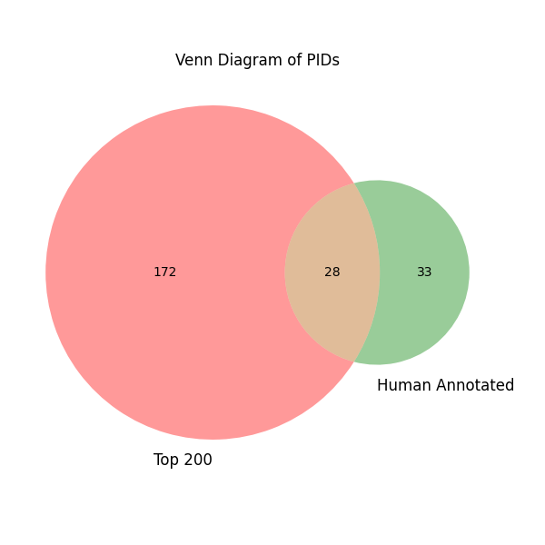

# PID Comparison Report

## Venn Diagram

## PID Comparison Table

| Source | pid_label | pid | count |
|--------|-----------|-----|-------|
| Only in Top 200 | diplomatic relation | P530 | 32732 |
| Only in Top 200 | country | P17 | 15219 |
| Only in Top 200 | occupation | P106 | 12285 |
| Only in Top 200 | languages spoken, written or signed | P1412 | 11590 |
| Only in Top 200 | twinned administrative body | P190 | 11216 |
| Only in Top 200 | sport | P641 | 7739 |
| Only in Top 200 | shares border with | P47 | 6116 |
| Only in Top 200 | place of birth | P19 | 6038 |
| Only in Top 200 | father | P22 | 4999 |
| Only in Top 200 | part of | P361 | 4526 |
| Only in Top 200 | family | P53 | 4329 |
| Only in Top 200 | member of | P463 | 4229 |
| Only in Top 200 | religion or worldview | P140 | 3812 |
| Only in Top 200 | contains the administrative territorial entity | P150 | 3810 |
| Only in Top 200 | participant | P710 | 3746 |
| Only in Top 200 | place of death | P20 | 3430 |
| Only in Top 200 | located in the administrative territorial entity | P131 | 3166 |
| Only in Top 200 | genre | P136 | 3007 |
| Only in Top 200 | head of government | P6 | 2853 |
| Only in Top 200 | country of origin | P495 | 2799 |
| Only in Top 200 | follows | P155 | 2731 |
| Only in Top 200 | followed by | P156 | 2690 |
| Only in Top 200 | country for sport | P1532 | 2690 |
| Only in Top 200 | native language | P103 | 2550 |
| Only in Top 200 | residence | P551 | 2363 |
| Only in Top 200 | member of sports team | P54 | 2079 |
| Only in Top 200 | organizer | P664 | 2011 |
| Only in Top 200 | work location | P937 | 1996 |
| Only in Top 200 | language used | P2936 | 1966 |
| Only in Top 200 | educated at | P69 | 1962 |
| Only in Top 200 | cast member | P161 | 1901 |
| Only in Top 200 | language of work or name | P407 | 1806 |
| Only in Top 200 | continent | P30 | 1805 |
| Only in Top 200 | playing hand | P741 | 1803 |
| Only in Top 200 | significant event | P793 | 1755 |
| Only in Top 200 | writing language | P6886 | 1719 |
| Only in Top 200 | headquarters location | P159 | 1601 |
| Only in Top 200 | relative | P1038 | 1590 |
| Only in Top 200 | member of political party | P102 | 1590 |
| Only in Top 200 | capital of | P1376 | 1428 |
| Only in Top 200 | official language | P37 | 1400 |
| Only in Top 200 | general classification of race participants | P2321 | 1326 |
| Only in Top 200 | location | P276 | 1226 |
| Only in Top 200 | head of state | P35 | 1218 |
| Only in Top 200 | capital | P36 | 1204 |
| Only in Top 200 | handedness | P552 | 1204 |
| Only in Top 200 | employer | P108 | 1158 |
| Only in Top 200 | field of work | P101 | 1130 |
| Only in Top 200 | instrument | P1303 | 1128 |
| Only in Top 200 | original language of film or TV show | P364 | 1096 |
| Only in Top 200 | place of burial | P119 | 928 |
| Only in Top 200 | cause of death | P509 | 871 |
| Only in Top 200 | record label | P264 | 790 |
| Only in Top 200 | ethnic group | P172 | 753 |
| Only in Top 200 | narrative location | P840 | 702 |
| Only in Top 200 | points classification | P3494 | 673 |
| Only in Top 200 | named after | P138 | 672 |
| Only in Top 200 | distribution format | P437 | 648 |
| Only in Top 200 | distributed by | P750 | 647 |
| Only in Top 200 | applies to jurisdiction | P1001 | 626 |
| Only in Top 200 | influenced by | P737 | 609 |
| Only in Top 200 | godparent | P1290 | 601 |
| Only in Top 200 | candidate | P726 | 600 |
| Only in Top 200 | subclass of | P279 | 589 |
| Only in Top 200 | unmarried partner | P451 | 529 |
| Only in Top 200 | has works in the collection | P6379 | 492 |
| Only in Top 200 | owner of | P1830 | 492 |
| Only in Top 200 | replaces | P1365 | 468 |
| Only in Top 200 | sports season of league or competition | P3450 | 461 |
| Only in Top 200 | conflict | P607 | 448 |
| Only in Top 200 | filming location | P915 | 439 |
| Only in Top 200 | chairperson | P488 | 437 |
| Only in Top 200 | screenwriter | P58 | 425 |
| Only in Top 200 | place of publication | P291 | 424 |
| Only in Top 200 | located in or next to body of water | P206 | 413 |
| Only in Top 200 | notable work | P800 | 378 |
| Only in Top 200 | medical condition | P1050 | 377 |
| Only in Top 200 | owned by | P127 | 349 |
| Only in Top 200 | basic form of government | P122 | 330 |
| Only in Top 200 | characters | P674 | 329 |
| Only in Top 200 | location of formation | P740 | 324 |
| Only in Top 200 | competition class | P2094 | 309 |
| Only in Top 200 | form of creative work | P7937 | 306 |
| Only in Top 200 | legislative body | P194 | 295 |
| Only in Top 200 | part of the series | P179 | 292 |
| Only in Top 200 | main subject | P921 | 285 |
| Only in Top 200 | political alignment | P1387 | 280 |
| Only in Top 200 | head coach | P286 | 277 |
| Only in Top 200 | currency | P38 | 276 |
| Only in Top 200 | public holiday | P832 | 268 |
| Only in Top 200 | located in/on physical feature | P706 | 261 |
| Only in Top 200 | honorific prefix | P511 | 252 |
| Only in Top 200 | producer | P162 | 250 |
| Only in Top 200 | production company | P272 | 237 |
| Only in Top 200 | sports discipline competed in | P2416 | 228 |
| Only in Top 200 | office held by head of government | P1313 | 218 |
| Only in Top 200 | original broadcaster | P449 | 217 |
| Only in Top 200 | anthem | P85 | 210 |
| Only in Top 200 | military rank | P410 | 209 |
| Only in Top 200 | voice type | P412 | 202 |
| Only in Top 200 | highest judicial authority | P209 | 200 |
| Only in Top 200 | sexual orientation | P91 | 198 |
| Only in Top 200 | mountains classification | P4320 | 195 |
| Only in Top 200 | political ideology | P1142 | 193 |
| Only in Top 200 | archives at | P485 | 192 |
| Only in Top 200 | has subsidiary | P355 | 188 |
| Only in Top 200 | parent organization | P749 | 182 |
| Only in Top 200 | office contested | P541 | 168 |
| Only in Top 200 | allegiance | P945 | 168 |
| Only in Top 200 | crew member(s) | P1029 | 165 |
| Only in Top 200 | operating area | P2541 | 162 |
| Only in Top 200 | facet of | P1269 | 155 |
| Only in Top 200 | participating team | P1923 | 152 |
| Only in Top 200 | league | P118 | 150 |
| Only in Top 200 | military branch | P241 | 148 |
| Only in Top 200 | official religion | P3075 | 142 |
| Only in Top 200 | present in work | P1441 | 124 |
| Only in Top 200 | creator | P170 | 122 |
| Only in Top 200 | office held by head of state | P1906 | 122 |
| Only in Top 200 | lifestyle | P1576 | 121 |
| Only in Top 200 | indigenous to | P2341 | 120 |
| Only in Top 200 | position played on team / speciality | P413 | 114 |
| Only in Top 200 | home venue | P115 | 112 |
| Only in Top 200 | academic degree | P512 | 112 |
| Only in Top 200 | composer | P86 | 108 |
| Only in Top 200 | voice actor | P725 | 106 |
| Only in Top 200 | derivative work | P4969 | 106 |
| Only in Top 200 | legal form | P1454 | 105 |
| Only in Top 200 | significant person | P3342 | 100 |
| Only in Top 200 | product or material produced or service provided | P1056 | 100 |
| Only in Top 200 | broadcast by | P3301 | 100 |
| Only in Top 200 | industry | P452 | 99 |
| Only in Top 200 | lyrics by | P676 | 97 |
| Only in Top 200 | occupant | P466 | 96 |
| Only in Top 200 | set in period | P2408 | 95 |
| Only in Top 200 | motto | P1546 | 93 |
| Only in Top 200 | source of income | P2770 | 91 |
| Only in Top 200 | manner of death | P1196 | 91 |
| Only in Top 200 | designated as terrorist by | P3461 | 90 |
| Only in Top 200 | interested in | P2650 | 90 |
| Only in Top 200 | mount | P3091 | 83 |
| Only in Top 200 | basin country | P205 | 82 |
| Only in Top 200 | located in the present-day administrative territorial entity | P3842 | 78 |
| Only in Top 200 | has cause | P828 | 78 |
| Only in Top 200 | has written for | P6872 | 77 |
| Only in Top 200 | opposite of | P461 | 77 |
| Only in Top 200 | authority | P797 | 73 |
| Only in Top 200 | young rider classification | P4323 | 73 |
| Only in Top 200 | stepparent | P3448 | 72 |
| Only in Top 200 | movement | P135 | 71 |
| Only in Top 200 | destination point | P1444 | 69 |
| Only in Top 200 | executive body | P208 | 68 |
| Only in Top 200 | separated from | P807 | 67 |
| Only in Top 200 | illustrator | P110 | 65 |
| Only in Top 200 | after a work by | P1877 | 65 |
| Only in Top 200 | parliamentary term | P2937 | 63 |
| Only in Top 200 | has effect | P1542 | 58 |
| Only in Top 200 | diocese | P708 | 58 |
| Only in Top 200 | coat of arms | P237 | 56 |
| Only in Top 200 | studied by | P2579 | 55 |
| Only in Top 200 | field of this occupation | P425 | 55 |
| Only in Top 200 | described by source | P1343 | 54 |
| Only in Top 200 | history of topic | P2184 | 54 |
| Only in Top 200 | lowest point | P1589 | 52 |
| Only in Top 200 | start point | P1427 | 52 |
| Only in Top 200 | model item | P5869 | 52 |
| Only in Top 200 | director / manager | P1037 | 51 |
| Only in Top 200 | business division | P199 | 51 |
| Only in Top 200 | sponsor | P859 | 51 |
| Only in Top 200 | signatory | P1891 | 51 |
| Only in Top 200 | flag | P163 | 49 |
| Only in Top 200 | practiced by | P3095 | 48 |
| Only in Human Annotated | votes received | P1111 | 42 |
| Only in Human Annotated | ranking | P1352 | 15 |
| Only in Human Annotated | number of matches played/races/starts | P1350 | 6 |
| Only in Human Annotated | number of points/goals/set scored | P1351 | 6 |
| Only in Human Annotated | point in time | P585 | 6 |
| Only in Human Annotated | number of wins | P1355 | 4 |
| Only in Human Annotated | number of losses | P1356 | 3 |
| Only in Human Annotated | doctoral advisor | P184 | 3 |
| Only in Human Annotated | start time | P580 | 3 |
| Only in Human Annotated | title | P1476 | 3 |
| Only in Human Annotated | duration | P2047 | 2 |
| Only in Human Annotated | number of draws/ties | P1357 | 2 |
| Only in Human Annotated | has certification | P10611 | 2 |
| Only in Human Annotated | in opposition to | P5004 | 2 |
| Only in Human Annotated | issued by | P2378 | 2 |
| Only in Human Annotated | results | P2501 | 2 |
| Only in Human Annotated | merged into | P7888 | 2 |
| Only in Human Annotated | inception | P571 | 2 |
| Only in Human Annotated | inspired by | P941 | 2 |
| Only in Human Annotated | carries passengers or cargo | P3437 | 1 |
| Only in Human Annotated | contributing factor of | P1537 | 1 |
| Only in Human Annotated | has goal | P3712 | 1 |
| Only in Human Annotated | total valid votes | P1697 | 1 |
| Only in Human Annotated | nominee | P2453 | 1 |
| Only in Human Annotated | operating income | P3362 | 1 |
| Only in Human Annotated | item operated | P121 | 1 |
| Only in Human Annotated | quantity | P1114 | 1 |
| Only in Human Annotated | documentation files at | P10527 | 1 |
| Only in Human Annotated | prisoner count | P5630 | 1 |
| Only in Human Annotated | elected in | P2715 | 1 |
| Only in Human Annotated | amended by | P2567 | 1 |
| Only in Human Annotated | presenter | P371 | 1 |
| Only in Human Annotated | finisher | P10729 | 1 |
| In Both | sibling | P3373 | 17920 |
| In Both | country of citizenship | P27 | 13312 |
| In Both | child | P40 | 12697 |
| In Both | participant in | P1344 | 8740 |
| In Both | spouse | P26 | 6072 |
| In Both | award received | P166 | 5241 |
| In Both | instance of | P31 | 4645 |
| In Both | mother | P25 | 4629 |
| In Both | has part(s) | P527 | 4604 |
| In Both | position held | P39 | 4165 |
| In Both | noble title | P97 | 2968 |
| In Both | winner | P1346 | 2505 |
| In Both | nominated for | P1411 | 2223 |
| In Both | founded by | P112 | 756 |
| In Both | director | P57 | 720 |
| In Both | victory | P2522 | 549 |
| In Both | candidacy in election | P3602 | 498 |
| In Both | author | P50 | 366 |
| In Both | performer | P175 | 332 |
| In Both | publisher | P123 | 237 |
| In Both | replaced by | P1366 | 220 |
| In Both | officeholder | P1308 | 194 |
| In Both | astronaut mission | P450 | 164 |
| In Both | based on | P144 | 137 |
| In Both | operator | P137 | 135 |
| In Both | partner in business or sport | P1327 | 122 |
| In Both | successful candidate | P991 | 115 |
| In Both | conferred by | P1027 | 114 |
